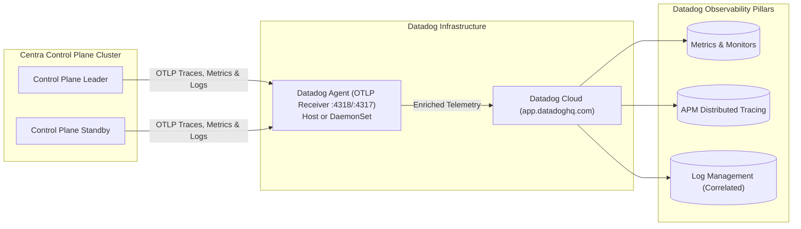

# Centra Control Plane Dashboard & Datadog Telemetry: Architecture & Specifications

> Architectural design, Angular standalone SPA specifications, Datadog full-stack observability integration, and HIPAA compliance safeguards for the Centra Control Plane.

---

## 🏛️ Executive Summary

The **Centra Control Plane Dashboard** serves as the central operational nerve center for multi-cluster Centra deployments. Built as an **embedded Angular Standalone Single-Page Application (SPA)** and backed by enterprise-grade **OpenTelemetry & Datadog ingestion**, it provides:

1. **Angular Standalone SPA**: Modern Angular architecture utilizing Angular Signals, standalone components, and native SSE (`EventSource`) services for real-time reactive streaming with zero memory drag on the Control Plane backend.
2. **Datadog Full-Stack Telemetry**: Direct ingestion of Control Plane metrics, traces, and structured logs via standard OTLP into Datadog, adhering to Datadog Unified Service Tagging (`service`, `env`, `version`) and automated log-to-trace correlation.
3. **HA Control Plane Cluster Status**: Real-time visualization of Active Leader vs. Standby nodes, lease renewal timers, and failover status.
4. **Multi-Cluster Fleet Topology**: Interactive node map across arbitrary clusters ($C_1, C_2, \dots, C_N$) with live health indicators, memory/CPU metrics, and operator node controls (drain, cordon).
5. **Virtual Actor Ring & Density Inspector**: Visual consistent hash rings, partition ownership, hotspot detection, and targeted actor passivation.
6. **Distributed Workflow & Saga Visualizer**: Execution timelines, activity retry tracking, saga compensation trees, and manual intervention.
7. **Dynamic Resilience Policy Live Tuner**: Visual editor for Polly v8 policies with instant SSE push to worker nodes.
8. **HIPAA & Compliance Safeguards**: Zero-PHI guarantee—all displays operate strictly on infrastructure metadata and de-identified entity keys with masked secrets.

---

## 🅰️ Frontend Architecture: Angular Standalone SPA

### 1. Framework Choice & Rationale
- **Angular (Standalone Architecture)**: Matches existing organizational developer tooling, provides strict TypeScript typing, robust CLI tooling (`ng build`), and enterprise component encapsulation.
- **Angular Signals (`signal()`, `computed()`)**: Perfect fit for high-frequency real-time updates. When SSE events arrive (`NodeHeartbeat`, `EpochIncremented`), Signals update only the specific UI components (e.g. node latency badge or lease progress bar) without full component re-rendering.
- **Embedded Static Asset Delivery**:
  - The Angular app builds into `src/Centra.ControlPlane/wwwroot/dashboard`.
  - Served directly by ASP.NET Core: `app.UseStaticFiles()` and `app.MapFallbackToFile("dashboard/{*path}", "dashboard/index.html")`.
  - Zero separate UI containers or node processes required in production.

---

### 2. Angular Directory & Module Structure

```
ui/dashboard/
├── angular.json
├── package.json
├── tsconfig.json
└── src/
    ├── app/
    │   ├── core/
    │   │   ├── services/
    │   │   │   ├── control-plane-api.service.ts     # Typed REST client for /api/v1/*
    │   │   │   ├── sse-stream.service.ts            # Native EventSource for /stream
    │   │   │   ├── topology-state.service.ts        # Angular Signal store for active nodes
    │   │   │   ├── auth.service.ts                  # Cluster token & RBAC management
    │   │   │   └── notification.service.ts          # Toast alerts & live ticker
    │   │   ├── models/
    │   │   │   ├── cluster-node.model.ts
    │   │   │   ├── leadership-state.model.ts
    │   │   │   ├── component-definition.model.ts
    │   │   │   └── resilience-policy.model.ts
    │   │   └── guards/
    │   │       └── auth.guard.ts
    │   ├── features/
    │   │   ├── overview/                            # HA Leader status & KPI cards
    │   │   │   ├── overview.component.ts
    │   │   │   └── components/
    │   │   │       └── lease-timer.component.ts
    │   │   ├── topology/                            # Multi-cluster explorer & node cards
    │   │   │   ├── topology.component.ts
    │   │   │   └── components/
    │   │   │       ├── node-card.component.ts
    │   │   │       └── node-actions-modal.component.ts
    │   │   ├── actors/                              # Virtual actor ring & hotspot detector
    │   │   │   ├── actors.component.ts
    │   │   │   └── components/
    │   │   │       ├── hash-ring-canvas.component.ts
    │   │   │       └── passivation-dialog.component.ts
    │   │   ├── workflows/                           # Workflow execution & Saga tree
    │   │   │   ├── workflows.component.ts
    │   │   │   └── components/
    │   │   │       ├── activity-timeline.component.ts
    │   │   │       └── saga-compensation-tree.component.ts
    │   │   ├── components/                          # Component catalog & masked secrets
    │   │   │   └── components.component.ts
    │   │   ├── resilience/                          # Dynamic resilience tuner
    │   │   │   └── resilience-editor.component.ts
    │   │   └── events/                              # Real-time SSE event ticker
    │   │       └── event-log.component.ts
    │   ├── shared/
    │   │   └── components/
    │   │       ├── cluster-selector.component.ts
    │   │       └── status-badge.component.ts
    │   ├── app.component.ts                         # Shell with navigation sidebar & header
    │   ├── app.config.ts                            # Angular app config with provideHttpClient, provideRouter
    │   └── app.routes.ts                            # Standalone routing table
    ├── assets/
    ├── index.html
    └── styles.scss
```

---

### 3. Reactive State via Angular Signals

```typescript
// topology-state.service.ts
@Injectable({ providedIn: 'root' })
export class TopologyStateService {
  private readonly sse = inject(SseStreamService);

  // Core Signals
  readonly activeCluster = signal<string>('all');
  readonly allNodes = signal<ClusterNode[]>([]);
  readonly leadership = signal<LeadershipState>({ role: 'Active', isLeader: true, leaseTtlSeconds: 4.0 });

  // Computed Signals
  readonly filteredNodes = computed(() => {
    const cluster = this.activeCluster();
    const nodes = this.allNodes();
    return cluster === 'all' ? nodes : nodes.filter(n => n.clusterId === cluster);
  });

  readonly clusterList = computed(() => {
    return Array.from(new Set(this.allNodes().map(n => n.clusterId)));
  });

  constructor() {
    this.sse.connectToTopologyStream().subscribe(event => {
      this.handleTopologySyncEvent(event);
    });
  }

  private handleTopologySyncEvent(event: TopologySyncEvent): void {
    if (event.action === 'FullSync') {
      this.allNodes.set(event.activeNodes);
    } else if (event.action === 'Joined' && event.node) {
      this.allNodes.update(nodes => [...nodes.filter(n => n.instanceId !== event.node!.instanceId), event.node!]);
    } else if (event.action === 'Left' && event.node) {
      this.allNodes.update(nodes => nodes.filter(n => n.instanceId !== event.node!.instanceId));
    }
  }
}
```

---

## 🐶 Datadog Telemetry & Full Observability Integration

The Centra Control Plane natively emits standard OpenTelemetry metrics, traces, and structured logs. Datadog ingests this data seamlessly via the **Datadog Agent OTLP Ingest Pipeline** or direct OTLP HTTP/gRPC export.



---

### 1. Datadog Unified Service Tagging
To automatically link metrics, traces, and logs in Datadog, the Control Plane injects Datadog's three standard tags:

| Tag | OpenTelemetry Attribute | Example Value | Description |
| :--- | :--- | :--- | :--- |
| **`service`** | `service.name` | `centra-controlplane` | Name of the service in Datadog Service Catalog. |
| **`env`** | `deployment.environment` | `production`, `staging` | Deployment environment for filtering and SLOs. |
| **`version`** | `service.version` | `1.0.0` | Framework & container image version for release tracking. |

#### Environment Variable Configuration (Docker / Kubernetes):
```bash
# Standard OpenTelemetry Resource Attributes
OTEL_SERVICE_NAME=centra-controlplane
OTEL_RESOURCE_ATTRIBUTES=deployment.environment=production,service.version=1.0.0

# OTLP Exporter pointing to local Datadog Agent (recommended):
OTEL_EXPORTER_OTLP_ENDPOINT=http://datadog-agent:4318
OTEL_EXPORTER_OTLP_PROTOCOL=http/protobuf

# Alternatively, direct to Datadog US1 Cloud (agentless):
# OTEL_EXPORTER_OTLP_ENDPOINT=https://otlp.datadoghq.com
# OTEL_EXPORTER_OTLP_HEADERS=dd-api-key=YOUR_DATADOG_API_KEY
```

---

### 2. Metrics Emitted for Datadog Dashboards

All metrics are registered in [`ControlPlaneMeters.cs`](../../src/Centra.ControlPlane/Diagnostics/ControlPlaneMeters.cs) under Meter `Centra.ControlPlane`:

| Metric Name | Type | Datadog Metric Type | Tags | Description |
| :--- | :--- | :--- | :--- | :--- |
| `centra.controlplane.leader.is_leader` | Gauge | GAUGE | `instance.id` | Reports `1` if this replica is the active leader, `0` if standby. |
| `centra.controlplane.leader.lease_time_remaining` | Gauge | GAUGE | `instance.id` | Time remaining (seconds) before leadership lease expires. |
| `centra.controlplane.heartbeats.received` | Counter | COUNT | `cluster.id`, `app.id`, `status` | Total heartbeats received from worker nodes. |
| `centra.controlplane.heartbeats.latency` | Histogram | HISTOGRAM | `cluster.id` | Latency of heartbeat ingestion in milliseconds (p95, p99). |
| `centra.controlplane.nodes.active` | UpDownCounter | GAUGE | `cluster.id`, `status` | Count of active, non-expired nodes per cluster. |
| `centra.controlplane.security.admission.rejected` | Counter | COUNT | `cluster.id`, `reason` | Count of rejected rogue node join attempts (`bad_token`, `replay`, `ip_mismatch`). |
| `centra.controlplane.sync.events.dispatched` | Counter | COUNT | `event.type`, `cluster.id` | Real-time mutations pushed via SSE. |
| `centra.controlplane.components.registered` | Counter | COUNT | `component.type` | Infrastructure components registered in catalog. |

---

### 3. Distributed Tracing & W3C / Datadog Context Propagation

- Traces are emitted via `ActivitySource("Centra.ControlPlane")`.
- When worker nodes call `/api/v1/heartbeat` or subscribe to SSE streams:
  - W3C `traceparent` and `tracestate` headers are extracted automatically.
  - Spans are correlated with upstream caller services (`integration-api`, `actor-api`).
- **Trace Spans Emitted**:
  - `Centra.ControlPlane.Heartbeat`: Traces the processing and admission check of worker heartbeats.
  - `Centra.ControlPlane.UpsertComponent`: Traces component catalog updates and secret resolutions.
  - `Centra.ControlPlane.Sync`: Traces SSE event packing and broadcast.
  - `Centra.ControlPlane.LeaderElection`: Traces distributed lock acquisition and renewals.

---

### 4. Structured Logs with Trace Correlation

All logs emitted via `ILogger` include `trace_id` and `span_id` scopes:
```json
{
  "timestamp": "2026-10-08T21:20:00.123Z",
  "level": "INFO",
  "message": "Node billing-api-2 registered in cluster billing-cluster with status Healthy",
  "service": "centra-controlplane",
  "env": "production",
  "version": "1.0.0",
  "dd.trace_id": "8472910481928374",
  "dd.span_id": "3849102938475819",
  "cluster_id": "billing-cluster",
  "app_id": "billing-api",
  "instance_id": "billing-api-2"
}
```
In the Datadog Log Explorer, clicking any log immediately jumps to the corresponding APM distributed trace!

---

### 5. Recommended Datadog Monitors & Alerts

1. **No Active Leader Alert (Critical - P1)**:
   - Metric: `sum:centra.controlplane.leader.is_leader{*}`
   - Condition: `< 1` for more than 5 seconds.
   - Action: PagerDuty alert—all Control Plane nodes are in Standby or crashed.
2. **Split-Brain Leader Alert (Critical - P1)**:
   - Metric: `sum:centra.controlplane.leader.is_leader{*}`
   - Condition: `> 1` for more than 2 seconds.
   - Action: PagerDuty alert—distributed lock split-brain detected.
3. **Rogue Node Join Attempt Spike (Warning - P3)**:
   - Metric: `sum:centra.controlplane.security.admission.rejected{*}.as_count()`
   - Condition: `> 5` in 1 minute.
   - Action: Slack alert to SecOps—potential unauthorized cluster join attack.
4. **Heartbeat Latency Degradation (Warning - P3)**:
   - Metric: `p99:centra.controlplane.heartbeats.latency{*}`
   - Condition: `> 50ms` for 5 minutes.
   - Action: Check database lock contention or CPU throttling on Control Plane pods.

---

## 🛡️ HIPAA Compliance & Zero-PHI Guardrails

1. **Zero Application Payload in Telemetry**:
   - Neither Datadog metrics, traces, nor logs receive application request payloads (e.g. patient names, SSNs, medical records).
   - Only infrastructure metadata (`cluster_id`, `node_id`, `event_type`) is tagged.
2. **Workflow History Masking in UI**:
   - The Angular workflow component requests history with `RedactWorkflowData = true`.
   - The UI never receives or renders raw activity byte arrays.
3. **Secret Masking**:
   - Connection strings are masked in the UI (`Password=********`) and stripped from all log outputs.
