# Package Ecosystem & Layering Architecture

> A complete map of Centra's 11 modular abstractions, 12 in-process implementations, 7 provider drivers, hosting integration, and control plane services.

---

## 📦 Layering Diagram

```mermaid
graph TD
    subgraph "Application Layer"
        APP[User Application / Minimal API]
    end

    subgraph "Hosting & Framework Integration"
        HOST[Centra.Hosting]
        CP[Centra.ControlPlane]
        ASPIRE[Centra.Aspire.Hosting]
    end

    subgraph "Umbrella Metapackage"
        META[Centra.Abstractions]
    end

    subgraph "Modular Abstractions"
        ABS_STATE[Centra.State.Abstractions]
        ABS_PUBSUB[Centra.PubSub.Abstractions]
        ABS_LOCKS[Centra.Locks.Abstractions]
        ABS_INVOKE[Centra.Invocation.Abstractions]
        ABS_BINDINGS[Centra.Bindings.Abstractions]
        ABS_EVENTS[Centra.Events.Abstractions]
        ABS_COMPONENTS[Centra.Components.Abstractions]
        ABS_SYNC[Centra.Sync.Abstractions]
        ABS_RESILIENCE[Centra.Resilience.Abstractions]
        ABS_ACTORS[Centra.Actors.Abstractions]
        ABS_WORKFLOWS[Centra.Workflows.Abstractions]
    end

    subgraph "Modular Implementations"
        IMPL_RUNTIME[Centra.Runtime]
        IMPL_SERIAL[Centra.Serialization]
        IMPL_STATE[Centra.State]
        IMPL_PUBSUB[Centra.PubSub]
        IMPL_LOCKS[Centra.Locks]
        IMPL_INVOKE[Centra.Invocation]
        IMPL_BINDINGS[Centra.Bindings]
        IMPL_EVENTS[Centra.Events]
        IMPL_SYNC[Centra.Sync]
        IMPL_RESILIENCE[Centra.Resilience]
        IMPL_ACTORS[Centra.Actors]
        IMPL_WORKFLOWS[Centra.Workflows]
    end

    subgraph "Physical Providers"
        P_MEM[Centra.Providers.InMemory]
        P_REDIS[Centra.Providers.Redis]
        P_PG[Centra.Providers.PostgreSql]
        P_RABBIT[Centra.Providers.RabbitMQ]
        P_SQL[Centra.Providers.SqlServer]
        P_ASB[Centra.Providers.AzureServiceBus]
        P_COSMOS[Centra.Providers.CosmosDb]
    end

    APP --> HOST
    HOST --> META
    HOST --> IMPL_RUNTIME
    META --> ABS_STATE
    META --> ABS_PUBSUB
    META --> ABS_LOCKS
    META --> ABS_INVOKE
    META --> ABS_BINDINGS
    META --> ABS_EVENTS
    META --> ABS_COMPONENTS
    META --> ABS_SYNC
    META --> ABS_RESILIENCE
    META --> ABS_ACTORS
    META --> ABS_WORKFLOWS

    IMPL_STATE -.-> ABS_STATE
    IMPL_PUBSUB -.-> ABS_PUBSUB
    IMPL_LOCKS -.-> ABS_LOCKS
    IMPL_INVOKE -.-> ABS_INVOKE
    IMPL_BINDINGS -.-> ABS_BINDINGS
    IMPL_EVENTS -.-> ABS_EVENTS
    IMPL_SYNC -.-> ABS_SYNC
    IMPL_RESILIENCE -.-> ABS_RESILIENCE
    IMPL_ACTORS -.-> ABS_ACTORS
    IMPL_WORKFLOWS -.-> ABS_WORKFLOWS

    P_MEM --> ABS_STATE
    P_REDIS --> ABS_STATE
    P_PG --> ABS_STATE
    P_RABBIT --> ABS_PUBSUB
    P_SQL --> ABS_STATE
    P_ASB --> ABS_PUBSUB
    P_COSMOS --> ABS_STATE
```

---

## 📋 The 11 Modular Abstractions

These packages contain zero third-party dependencies, zero heavy runtime logic, and strictly define interfaces, attributes, and lightweight DTOs:

| Package | Primary Role | Key Types |
| :--- | :--- | :--- |
| `Centra.Events.Abstractions` | CNCF CloudEvents v1.0 specifications | `CloudEvent`, `EventContext`, `CentraAmbientContext` |
| `Centra.Components.Abstractions` | Component definitions & registration metadata | `ComponentDefinition`, `ComponentType`, `IComponentRegistry` |
| `Centra.PubSub.Abstractions` | Pub/Sub producer & consumer contracts | `IPubSubClient`, `IEventHandler<T>`, `[Topic]`, `IPubSubDriver` |
| `Centra.State.Abstractions` | Key/value state store, transactions & ETags | `IStateStore<T>`, `StateEntry<T>`, `ITransactionalStateStore`, `IStateStoreDriver` |
| `Centra.Locks.Abstractions` | Distributed mutual exclusion & lease contracts | `IDistributedLockProvider`, `IDistributedLock`, `IDistributedLockDriver` |
| `Centra.Invocation.Abstractions` | Declarative RPC interfaces & routing | `IServiceInvoker`, `[ServiceClient]`, `[ServiceMethod]`, `IServiceEndpointResolver` |
| `Centra.Bindings.Abstractions` | Schedulers, cron triggers & I/O bindings | `IScheduler`, `[CronBinding]`, `IJobHandler`, `IInputBinding`, `IOutputBinding`, `IBindingDriver` |
| `Centra.Sync.Abstractions` | Control plane sync protocols & topology | `IControlPlaneClient`, `IClusterTopologyProvider`, `ComponentSyncEventDto` |
| `Centra.Resilience.Abstractions` | Fault tolerance & Polly composite options | `IResiliencePipelineProvider`, `IResiliencePipeline`, `CentraResiliencePolicyDefinition` |
| `Centra.Actors.Abstractions` | Distributed virtual actors runtime contracts | `IActor`, `Actor`, `ActorIdentity`, `IActorProxyFactory`, `IActorStateManager`, `IActorReminderManager` |
| `Centra.Workflows.Abstractions` | Durable orchestrations & sagas | `IWorkflow`, `Workflow<TIn, TOut>`, `IWorkflowActivity`, `WorkflowActivity<TIn, TOut>`, `IWorkflowSaga` |

---

## ⚙️ The 12 Modular Implementations

These packages implement the runtime execution pipelines, serialization, and coordination:

| Package | Contents |
| :--- | :--- |
| `Centra.Runtime` | OpenTelemetry tracing (`CentraDiagnostics`), metrics (`CentraMeters`), logging, `PooledByteBufferWriter`, component registry. |
| `Centra.Serialization` | `JsonCentraSerializer` with System.Text.Json high-performance serialization. |
| `Centra.Events` | `CloudEventPacker` and `CloudEventUnpacker` supporting Binary and Structured framing. |
| `Centra.Resilience` | Polly Core v8 composite pipelines (Timeout -> Bulkhead -> RateLimiter -> CircuitBreaker -> Retry). |
| `Centra.Sync` | Client-side control plane sync client, topology polling, and real-time SSE stream reader. |
| `Centra.Locks` | `CentraDistributedLockProvider` orchestrating driver leases and background heartbeats. |
| `Centra.State` | `CentraStateStore` and generic `CentraStateStore<T>` with ETag CAS retries. |
| `Centra.PubSub` | `CentraPubSubClient` packing domain models into CloudEvents with ambient W3C headers. |
| `Centra.Bindings` | Bitmask 64-bit Cron scheduler (`CentraCronScheduler`), input trigger dispatcher, and resilient output binding. |
| `Centra.Invocation` | Dynamic client proxy generation (`ServiceProxyFactory`), endpoint resolution, and HTTP dispatch. |
| `Centra.Actors` | Turn-based mailbox (`ActorMailbox`), consistent hash ring (`ConsistentHashRing`), state dirty-tracking, reminders. |
| `Centra.Workflows` | Deterministic replay context (`DeterministicWorkflowContext`), saga compensation runner, durable timers, and client. |

---

## 🔌 The 7 Distributed Providers

Centra's driver SPI decouples physical drivers from domain logic:

| Provider Package | SPI Drivers Implemented |
| :--- | :--- |
| `Centra.Providers.InMemory` | `InMemoryStateStoreDriver`, `InMemoryPubSubDriver`, `InMemoryDistributedLockDriver`, `InMemoryBindingDriver` |
| `Centra.Providers.Redis` | `RedisStateStoreDriver`, `RedisPubSubDriver`, `RedisDistributedLockDriver` |
| `Centra.Providers.PostgreSql` | `PostgreSqlStateStoreDriver`, `PostgreSqlDistributedLockDriver` |
| `Centra.Providers.RabbitMQ` | `RabbitMQPubSubDriver` |
| `Centra.Providers.SqlServer` | `SqlServerStateStoreDriver`, `SqlServerDistributedLockDriver` |
| `Centra.Providers.AzureServiceBus` | `AzureServiceBusPubSubDriver` |
| `Centra.Providers.CosmosDb` | `CosmosDbStateStoreDriver`, `CosmosDbDistributedLockDriver` |

---

## 🚀 Hosting & Control Plane

- **`Centra.Hosting`**: Integrates Centra into ASP.NET Core and Microsoft.Extensions.Hosting. Supports two complementary configuration models: declarative auto-discovery via the attribute reflection scanner (`CentraAttributeScanner`) and programmatic wiring via fluent `IServiceCollection` extension methods. Also provides minimal API route builders (`MapCentraEndpoints`, `MapCentraActorEndpoints`, `MapCentraWorkflowEndpoints`) and hosted services.
- **`Centra.ControlPlane`**: Standalone ASP.NET Core service providing centralized component catalog management, secret resolution, cluster topology heartbeats, real-time SSE event broadcasting, and actor/workflow inspection APIs.
- **`Centra.Aspire.Hosting`**: .NET Aspire AppHost integration extensions (`AddCentraControlPlane`, `WithCentra`) for local multi-replica orchestration.
