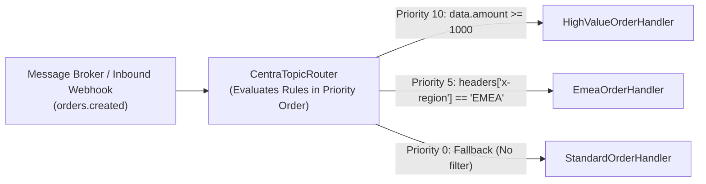
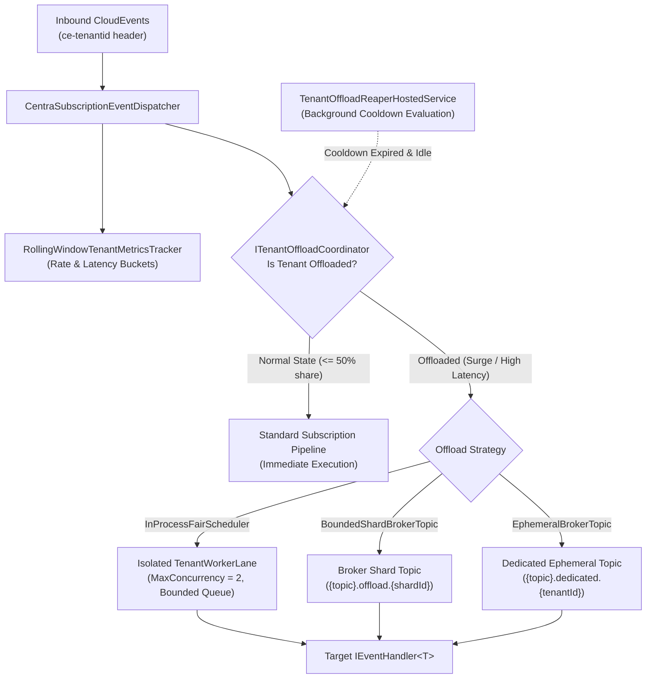

# Pub/Sub Messaging & CNCF CloudEvents v1.0

> Publish and subscribe to events across microservices using CNCF CloudEvents v1.0, consumer groups, dead lettering, and ambient W3C distributed tracing context.

---

## 🎯 Key Concepts

- **`IPubSubClient`**: Unified publishing client wrapping payloads into CloudEvents.
- **`IEventHandler<T>`**: Strongly typed consumer interface.
- **`[Topic]` Attribute**: Declarative metadata associating handlers with pub/sub component names, topics, dead-letter targets, consumer modes, rule filters, and priority.
- **Dynamic Content-Based Routing**: CEL-style rule expressions and programmatic predicates for selective event dispatch to prioritized handlers.
- **CNCF CloudEvents v1.0**: Standardized envelopes supporting both **Binary Mode** (default zero-alloc) and **Structured Mode**.

---

## 🛠️ Registration

Centra supports two ways to register pub/sub event handlers:

### Option A: Declarative via `[Topic]` Attribute (Automatic Discovery)
Decorate your handler class with `[Topic]` and call `builder.Services.AddCentra()` in `Program.cs`. Centra's assembly scanner automatically discovers and registers all decorated handlers:

```csharp
// 1. Add Centra and scan entry assembly
builder.Services.AddCentra();

// 2. Add provider (e.g. RabbitMQ, Redis, Azure Service Bus, or InMemory)
builder.Services.AddCentraRabbitMQ(options =>
{
    options.HostName = "localhost";
    options.ExchangeName = "centra.events";
});
```

### Option B: Programmatic via `AddCentraEventHandler` Extension (Explicit & Dynamic Overrides)
Use `AddCentraEventHandler<THandler, TEvent>()` to explicitly register a handler or dynamically configure topic names, pub/sub brokers, dead-letter topics, or consumer modes from runtime settings:

```csharp
// 1. Add Pub/Sub building blocks (modular registration adhering to ISP)
builder.Services.AddCentraPubSub();

// 2. Add provider
builder.Services.AddCentraRabbitMQ(options =>
{
    options.HostName = "localhost";
    options.ExchangeName = "centra.events";
});

// 3. Explicit programmatic registration with runtime parameters
builder.Services.AddCentraEventHandler<PaymentNotificationHandler, OrderCreatedEvent>(
    pubSubName: builder.Configuration["PubSub:ComponentName"] ?? "pubsub",
    topic: builder.Configuration["PubSub:OrdersTopic"] ?? "orders.created",
    deadLetterTopic: "orders.created.dlq",
    consumerMode: ConsumerMode.CompetingConsumer);
```

> [!TIP]
> **Precedence & Fallback Rule**: Explicit parameters passed to `AddCentraEventHandler` take precedence and override values declared on the `[Topic]` attribute. Any argument left as `null` falls back to the `[Topic]` attribute on the handler, and if omitted there, to framework defaults.

---

## 📤 Publishing Events

Inject `IPubSubClient` and publish your domain event record:

```csharp
app.MapPost("/checkout", async (CheckoutRequest request, IPubSubClient pubSub) =>
{
    var @event = new OrderCreatedEvent(
        OrderId: $"ord-{Guid.NewGuid():N}"[..12],
        CustomerId: request.CustomerId,
        Amount: request.TotalAmount);

    // Publishes to default pubsub component and "orders.created" topic
    await pubSub.PublishAsync("orders.created", @event);

    return Results.Accepted();
});
```

### Specifying Options & Metadata
You can customize the CloudEvent mode and add enterprise extensions:

```csharp
var options = new PubSubPublishOptions(
    PubSubName: "custom-bus",
    Mode: CloudEventMode.Binary, // Raw bytes body + ce-* headers (fastest)
    Metadata: new Dictionary<string, string>
    {
        ["ce-tenantid"] = "tenant-emea-42",
        ["ce-correlationid"] = correlationId
    });

await pubSub.PublishAsync("orders.created", @event, options);
```

---

## 📥 Subscribing with Pure Handlers

Implement `IEventHandler<T>` and decorate your class with `[Topic]`:

```csharp
using Centra.Events;
using Centra.PubSub;

[Topic(
    PubSubName = "pubsub", 
    Topic = "orders.created", 
    DeadLetterTopic = "orders.created.dlq",
    ConsumerMode = ConsumerMode.CompetingConsumer)]
public sealed class PaymentNotificationHandler : IEventHandler<OrderCreatedEvent>
{
    private readonly ILogger<PaymentNotificationHandler> _logger;

    public PaymentNotificationHandler(ILogger<PaymentNotificationHandler> logger)
    {
        _logger = logger;
    }

    public async Task<EventHandlingResult> HandleAsync(
        OrderCreatedEvent @event, 
        EventContext context, 
        CancellationToken cancellationToken)
    {
        _logger.LogInformation("Processing event {EventId} for order {OrderId}. Source: {Source}",
            context.Id, @event.OrderId, context.Source);

        try
        {
            await ProcessPaymentAsync(@event, cancellationToken);
            return EventHandlingResult.Success;
        }
        catch (TransientGatewayException)
        {
            // Requests redelivery / retry from the message broker
            return EventHandlingResult.Retry;
        }
        catch (InvalidOrderException)
        {
            // Moves event directly to DeadLetterTopic
            return EventHandlingResult.DeadLetter;
        }
    }
}
```

### Event Handling Return Statuses:
- **`EventHandlingResult.Success`**: Acknowledges message receipt (`Complete` / `Ack`).
- **`EventHandlingResult.Retry`**: Rejects and returns message to broker for redelivery (`Nack` / `Abandon`), unbounded unless the subscription configures a redelivery budget - when one is configured, the message is dead-lettered after `MaxRetryAttempts` redeliveries with exponential backoff (see [Bounded Redelivery Budget](#-bounded-redelivery-budget)).
- **`EventHandlingResult.Drop`**: Drops the message without retry. It is rejected without requeue, so a queue configured with a dead-letter route captures it there for audit; without one the broker discards it.
- **`EventHandlingResult.DeadLetter`**: Routes message to dead-letter queue / topic.

---

## ⚡ Consumer Tuning & Extended Subscription Options

Centra provides fine-grained control over message prefetching, concurrency, and queue lifecycle both declaratively via `[Topic]` and programmatically via `PubSubSubscribeOptions`:

| Option | `[Topic]` Attribute | `PubSubSubscribeOptions` | Description |
| :--- | :--- | :--- | :--- |
| **Prefetch Count** | `PrefetchCount = 50` | `PrefetchCount = 50` | Number of unacknowledged messages the broker pushes to the client buffer before waiting for ACKs. In RabbitMQ, configures `BasicQosAsync`. In Azure Service Bus and Redis Streams, governs prefetch buffers and stream batch sizes. |
| **Max Concurrency** | `MaxConcurrentCalls = 4` | `MaxConcurrentCalls = 4` | Maximum number of concurrent handler invocations executed in parallel on a single consumer instance. Managed via `SemaphoreSlim` in RabbitMQ / In-Memory and native processor concurrency in Azure Service Bus. |
| **Message TTL** | `MessageTtlSeconds = 60` | `MessageTimeToLive = TimeSpan.FromMinutes(1)` | Expiration duration for queued messages (`x-message-ttl` in RabbitMQ). |
| **Auto-Delete** | `AutoDelete = true` | `AutoDelete = true` | Automatically destroys the queue when the last consumer disconnects (useful for ephemeral telemetry and test listeners). |
| **Custom Args** | — | `CustomArguments = new Dictionary<string, object?> { ["x-queue-type"] = "quorum" }` | Universal escape hatch for broker-specific queue arguments without breaking vendor neutrality. |
| **Retry Budget** | — | `MaxRetryAttempts = 3` | Redeliveries granted to a handler returning `Retry` before the message is dead-lettered. Opt-in: unset means no budget at all. A budget of 3 lets a persistently failing message reach the handler at most 4 times. |
| **Retry Backoff** | — | `RetryInitialBackoff = TimeSpan.FromSeconds(1)` | Delay before the first redelivery, doubled on each subsequent retry. |
| **Retry Backoff Ceiling** | — | `RetryMaxBackoff = TimeSpan.FromSeconds(30)` | Upper bound applied to the doubling retry backoff. |

### Example: High-Throughput Worker with Bounded Concurrency

```csharp
[Topic("pubsub", "orders.created",
    PrefetchCount = 50,
    MaxConcurrentCalls = 8,
    MessageTtlSeconds = 300)]
public sealed class OrderProcessorHandler : IEventHandler<OrderCreatedEvent>
{
    public async Task<EventHandlingResult> HandleAsync(OrderCreatedEvent @event, EventContext context, CancellationToken ct)
    {
        await ProcessAsync(@event, ct);
        return EventHandlingResult.Success;
    }
}
```

---

## 🔁 Bounded Redelivery Budget

The redelivery budget is **opt-in**. Unless a subscription sets `MaxRetryAttempts`, `EventHandlingResult.Retry`
keeps its plain meaning - nack-requeue, unbounded - and the queue is declared exactly as it was before this
feature existed. A subscription that does set it gets that many redeliveries with exponentially growing
backoff, and the message is then dead-lettered.

The bound is enforced **by the consumer**, not by the broker.

This has to live in the consumer because broker delivery limits do not count application-initiated requeues.
RabbitMQ advances `x-delivery-count` only when a delivery is returned by consumer or channel failure; an
explicit `basic.nack(requeue=true)` is invisible to it, so `x-delivery-limit` never fires and the retry loop
runs hot and unbounded. Keep `x-delivery-limit` on the queue if you want a backstop against channel-failure
loops, but never rely on it for application-level retry.

```csharp
await subscriber.SubscribeAsync(
    "pubsub",
    "orders.created",
    handler,
    deadLetterTopic: "orders.created.dead",
    options: new PubSubSubscribeOptions
    {
        MaxRetryAttempts = 3,                                // 3 redeliveries, so 4 handler invocations
        RetryInitialBackoff = TimeSpan.FromSeconds(1),       // 1s, 2s, 4s, ...
        RetryMaxBackoff = TimeSpan.FromSeconds(30)
    });
```

Provider-wide defaults live on the provider options (`RabbitMQProviderOptions.DefaultMaxRetryAttempts`,
`DefaultRetryInitialBackoff`, `DefaultRetryMaxBackoff`); per-subscription values override them property by
property. `DefaultMaxRetryAttempts` is 0, which is what makes the feature opt-in; raise it to bound every
subscription that does not override it, and give each of those a dead-letter topic. An explicit
`MaxRetryAttempts = 0` means the same thing as leaving it unset: no budget.

Attempts are counted per subscription queue and message id (the CloudEvents `ce-id` header, falling back to
the AMQP `message-id` property) in an in-process tracker, so a message that carries neither cannot be counted
and is dead-lettered rather than requeued forever, and two subscriptions receiving the same event each spend
their own budget. Because the count is process-local, the budget restarts if the consumer restarts or the
message is redelivered to a different replica - the loop stays bounded per consumer, which is what the budget
guarantees.

### A budgeted subscription requires a dead-letter route

A spent budget settles as reject-without-requeue, which the broker discards outright unless the queue carries
a dead-letter route. RabbitMQ fixes queue arguments at declare time, so the route cannot be added afterwards -
the RabbitMQ driver therefore **refuses the subscription** with an `InvalidOperationException` when a budget is
in effect and no `deadLetterTopic` is supplied. Losing messages is never the quieter default. A subscription
with no budget is never refused and never gets dead-letter queue arguments it did not ask for.

### Opting an existing queue in

Because `x-dead-letter-exchange` and `x-dead-letter-routing-key` are fixed when the queue is declared, adding a
budget plus a `deadLetterTopic` to a subscription whose **durable queue already exists** makes RabbitMQ answer
the redeclare with `406 PRECONDITION_FAILED`. The remedy is to delete and recreate that queue; there is no
in-place migration. Subscriptions that stay unbudgeted are unaffected, because their declare is byte-for-byte
what it was before.

### Limitation: `[Topic]` and `AddCentraEventHandler` cannot opt in

The attribute and registration surfaces expose no retry-budget setting, so a handler registered that way is
always unbudgeted. Opting in today means calling `IPubSubSubscriber.SubscribeAsync` directly with both
`MaxRetryAttempts` and a `deadLetterTopic`.

### Backoff delays the subscription, not just the message

The backoff is awaited inside the consumer callback, and RabbitMQ dispatches callbacks sequentially per
channel. With the default `MaxConcurrentCalls = 1`, a persistently failing message therefore stalls every
other delivery on that subscription for the duration of its backoff: `RetryMaxBackoff` is a direct bound on
worst-case head-of-line delay. Raise `MaxConcurrentCalls` above 1 if other messages must keep flowing while
one retries. The delay observes subscription shutdown - `UnsubscribeAsync` / `DisposeAsync` interrupt it and
leave the delivery unacknowledged for the broker to redeliver.

### Other providers reject the options

Only the RabbitMQ driver enforces the budget today. The Redis, in-memory and Azure Service Bus drivers throw
`NotSupportedException` when a subscription sets `MaxRetryAttempts`, `RetryInitialBackoff` or
`RetryMaxBackoff`, rather than accepting options they would ignore.

---

## 🔀 Dynamic & Content-Based Routing (Rule Filters)

Centra allows multiple handlers or distinct routing paths to subscribe to the same pub/sub component and topic. Incoming events can be evaluated against **CEL-style rule expressions** or **programmatic C# predicates**, dispatched to the highest-priority matching handler, and executed within a single, consolidated subscription.

### Architecture: Single Broker Subscription per Topic

In distributed messaging, declaring multiple consumers on the same topic typically results in duplicate message deliveries, competing consumers randomly stealing messages, or ASP.NET Core `AmbiguousMatchException` when mounting duplicate HTTP webhook endpoints.

Centra solves this architecturally:
1. **Consolidated Broker Subscription**: Regardless of how many handlers or routes are configured for a given `(PubSubName, Topic)`, Centra subscribes to the underlying broker (RabbitMQ, Redis, Azure Service Bus, In-Memory) **exactly once**.
2. **Single Endpoint Mapping**: Centra maps a single internal endpoint route `/centra/events/{pubsub}/{topic}`.
3. **Internal Priority-Ordered Dispatch**: Incoming events are dispatched through `CentraTopicRouter`, which evaluates compiled rule filters and predicates in descending priority order (`Priority = 10` before `Priority = 0`).
4. **Subscription Options Merging**: If different handlers specify varying subscription QoS, Centra safely consolidates them (maximum prefetch count, maximum concurrent calls, minimum TTL, and persistent queue retention if any route requests it).



---

### Rule Filter Expression Reference

Rule filter expressions are parsed into an Abstract Syntax Tree (AST) at startup and compiled for zero-reflection, high-throughput evaluation during event delivery.

| Property Scope | Expression Syntax | Description |
| :--- | :--- | :--- |
| **CloudEvent Attributes** | `event.type`, `event.source`, `event.subject`, `event.id`, `event.datacontenttype` | Evaluates top-level CloudEvents v1.0 envelope metadata. |
| **Transport Headers** | `headers['x-custom-key']` | Evaluates ambient headers, AMQP properties, or HTTP headers. |
| **Event Payload Data** | `data.field` or `event.data.nested.field` | Traverses JSON payload properties. |

#### Supported Operators & Functions

- **Equality & Comparison**: `==`, `!=`, `<`, `<=`, `>`, `>=`
- **Logical Operators**: `&&`, `||`, `!` (with standard precedence and grouping via `(...)`)
- **String Functions**:
  - `startsWith(property, 'prefix')`
  - `endsWith(property, 'suffix')`
  - `contains(property, 'substring')`
- **Set Membership**:
  - `property in ['value1', 'value2', 'value3']`
- **Literal Types**: Strings (`'text'`), Numbers (`100`, `99.95`), Booleans (`true`, `false`), and `null`.

> [!TIP]
> **Zero-Allocation Payload Bypass**: The compiler detects `RequiresDataPayload`. If all rule filters on a topic inspect only CloudEvent envelope attributes or headers (e.g., `event.type == 'orders.v2' && headers['x-tier'] == 'gold'`), Centra completely skips parsing the JSON payload into a `JsonDocument`, ensuring zero heap allocation during routing.

---

### Declarative Routing via `[Topic]`

Apply `RuleFilter` and `Priority` directly to your handler implementations:

```csharp
[Topic("orders-pubsub", "orders.created", 
    RuleFilter = "data.totalAmount >= 1000", 
    Priority = 10)]
public sealed class HighValueOrderHandler : IEventHandler<OrderCreatedEvent>
{
    public async Task<EventHandlingResult> HandleAsync(OrderCreatedEvent @event, EventContext context, CancellationToken ct)
    {
        // Handles orders with TotalAmount >= $1,000
        return EventHandlingResult.Success;
    }
}

[Topic("orders-pubsub", "orders.created", Priority = 0)]
public sealed class StandardOrderHandler : IEventHandler<OrderCreatedEvent>
{
    public async Task<EventHandlingResult> HandleAsync(OrderCreatedEvent @event, EventContext context, CancellationToken ct)
    {
        // Fallback default handler for all other orders
        return EventHandlingResult.Success;
    }
}
```

---

### Programmatic Dynamic Routing & Typed Predicates

For dynamic configuration from external settings or strongly-typed C# predicate evaluation, use the `AddCentraEventHandler` overloads:

```csharp
// 1. Route using CEL-style expression from configuration:
builder.Services.AddCentraEventHandler<RegionOrderHandler, OrderCreatedEvent>(
    pubSubName: "orders-pubsub",
    topic: "orders.created",
    ruleFilter: "headers['x-region'] == 'EU-WEST'",
    priority: 20);

// 2. Route using a strongly typed C# predicate:
builder.Services.AddCentraEventHandler<VipCustomerOrderHandler, OrderCreatedEvent>(
    pubSubName: "orders-pubsub",
    topic: "orders.created",
    priority: 15,
    predicate: (@event, context) => @event.TotalAmount >= 500 && @event.CustomerId.StartsWith("VIP-"));

// 3. Fallback route (Priority 0, no filter):
builder.Services.AddCentraEventHandler<StandardOrderHandler, OrderCreatedEvent>(
    pubSubName: "orders-pubsub",
    topic: "orders.created",
    priority: 0);
```

#### Routing Resolution Order
1. Handlers are evaluated in descending order of `Priority` (highest priority evaluated first).
2. For each handler, its `RuleFilter` (if defined) and its `Predicate` (if defined) must both evaluate to `true`.
3. The first route whose filter evaluates to `true` handles the event.
4. If no filtered route matches, Centra executes the default route (the route with no filter or predicate, if configured).
5. If no route matches and no default route exists, the event is safely acknowledged and dropped without error.

---

## 🔗 Ambient W3C TraceContext Propagation

When an event is published, Centra injects the current W3C `traceparent` and `tracestate` into the CloudEvent headers or AMQP properties.

When the subscriber handler runs, Centra automatically:
1. Extracts `traceparent` and `tracestate`.
2. Starts an OpenTelemetry activity (`ActivityKind.Consumer`) with the publisher as parent.
3. Propagates the ambient context into your ASP.NET Core `HttpContext` and downstream service calls.

---

## 🏢 Dynamic Noisy Neighbor Tenant Offloading & Fair Scheduling

In multi-tenant systems sharing a single pub/sub broker topic, an unconstrained burst from one tenant ("noisy neighbor") can saturate consumer thread pools, exhaust worker mailboxes, and starve other well-behaved tenants of processing capacity.

Centra solves this natively through **Dynamic Tenant Offloading and Fair Scheduling**:



### 1. Rolling Window Metrics Tracking

Centra tracks per-tenant traffic across sliding evaluation windows using [`RollingWindowTenantMetricsTracker`](../../src/Centra.PubSub/Tenancy/RollingWindowTenantMetricsTracker.cs).
- **Time-Bucketed Rings**: Buckets are indexed by UNIX epoch seconds, eliminating memory leaks and avoiding GC overhead.
- **Dual Tracking**: Automatically aggregates both per-tenant stats and overall topic stats (`TenantTopicKey.OverallTenantId`).
- **Zero Heap Allocations**: Pure value-type accumulators (`TenantWindowBucket`) for message counts and duration sums.

### 2. Anomaly Detection & Triggers

[`ITenantOffloadCoordinator`](../../src/Centra.PubSub.Abstractions/Tenancy/ITenantOffloadCoordinator.cs) monitors tenants against configurable thresholds:

- **`TrafficShareThreshold`**: Maximum fraction of topic traffic a single tenant may consume within the window (e.g., `0.50` = 50%).
- **`DurationMultiplierThreshold`**: Relative execution latency compared to the topic-wide average (e.g., `3.0` = 3x slower).
- **`DurationAbsoluteThresholdMs`**: Optional hard upper bound for average processing latency.
- **`MinSampleCount`**: Minimum event sample size required before an offload evaluation triggers, avoiding false positives on sparse traffic.

When a trigger fires, the tenant transitions from `Normal` to `Offloaded` state, emitting `centra.tenant.state.transitions`.

### 3. Pluggable Offload Strategies

| Strategy | `TenantOffloadStrategyType` | Behavior | Best Used For |
| :--- | :--- | :--- | :--- |
| **In-Process Fair Scheduler** | `InProcessFairScheduler` | Queues messages into an isolated, per-tenant [`TenantWorkerLane`](../../src/Centra.PubSub/Tenancy/TenantWorkerLane.cs) with bounded concurrency (`MaxConcurrencyPerTenant`) and capacity (`PerTenantQueueCapacity`). Well-behaved tenants execute immediately without starvation. | Applications processing multi-tenant events on standard broker topologies without provisioning separate broker queues. |
| **Bounded Shard Broker Topic** | `BoundedShardBrokerTopic` | Outbound publisher traffic and re-routed subscriber events are steered to a deterministic pool of physical broker topics (`{topic}.offload.{shardId}`) using 32-bit FNV-1a hashing via [`TenantDeterministicHash`](../../src/Centra.PubSub/Tenancy/TenantDeterministicHash.cs). | High-scale Kafka, RabbitMQ, or Azure Service Bus workloads that need physical partition isolation. |
| **Ephemeral Broker Topic** | `EphemeralBrokerTopic` | Creates dynamic, dedicated broker topics per noisy tenant (`{topic}.offload.{tenantId}`) with auto-delete and TTL. | Workloads requiring strict physical queue isolation during long-running tenant bursts. |

### 4. Publisher Steering & Subscriber Interception

- **Publisher Side**: When `EnablePublisherBypassing = true`, [`CentraPubSubClient.PublishAsync`](../../src/Centra.PubSub/PubSub/CentraPubSubClient.cs) queries `ResolvePublishTopic`. If the tenant is offloaded, outgoing traffic is routed directly to the offload topic shard, bypassing the primary broker topic entirely.
- **Subscriber Side**: [`CentraSubscriptionEventDispatcher`](../../src/Centra.Hosting/HostedServices/CentraSubscriptionEventDispatcher.cs) intercepts incoming events tagged with `ce-tenantid`. If the tenant is offloaded, it delegates to `ITenantOffloadCoordinator.HandleOffloadAsync(...)`.

### 5. Cooldown, State Recovery & 5-Phase Safe Reaping

- **Cooldown Grace Period**: Once a tenant's burst drops below the thresholds, the coordinator observes a configurable `CooldownPeriod` (e.g., 30s) before restoring the tenant to `Normal` state.
- **Idle Resource Reclamation**: [`TenantOffloadReaperHostedService`](../../src/Centra.Hosting/HostedServices/TenantOffloadReaperHostedService.cs) periodically inspects lanes and ephemeral broker topics, safely decommissioning idle resources once inactive past `LaneIdleTimeout` or `ReapQuarantineWindow`.

#### The 5-Phase Ephemeral Reaping Protocol
When using `EphemeralBrokerTopic`, simply tearing down a broker queue when idle creates severe message loss hazards (e.g., in RabbitMQ, queues with `autoDelete: true` are destroyed the instant consumer count hits 0, deleting unacknowledged messages). Centra enforces a strict 5-phase sequence before deleting any ephemeral queue:
1. **Publisher Cutoff (`Draining` State)**: The coordinator moves the tenant to `TenantOffloadState.Draining`. `ResolvePublishTopic` instantly routes new outbound publications back to the primary topic (`baseTopic`), ensuring zero new messages enter the ephemeral queue.
2. **In-Flight Turn Protection**: [`EphemeralTopicTurnTracker`](../../src/Centra.PubSub/Tenancy/EphemeralTopicTurnTracker.cs) checks active consumer turns. If any event handler is actively executing, reaping aborts immediately and retries on the next cycle.
3. **Queue Depth Inspection**: The reaper queries [`IPubSubQueueInspector`](../../src/Centra.PubSub.Abstractions/IPubSubQueueInspector.cs) on the broker driver (e.g., AMQP passive queue inspection). Teardown proceeds only if `MessageCount == 0`.
4. **Distributed Lock Mutual Exclusion**: If running across multiple instances, the reaper acquires an [`IDistributedLockProvider`](../../src/Centra.DistributedLock.Abstractions/IDistributedLockProvider.cs) lock (`centra:reaper:{tenantId}:{topic}`) to guarantee mutual exclusion.
5. **Clean Broker Queue Reclaim**: Consumers unsubscribe cleanly, the broker queue is safely deleted, and the tenant transitions back to `Normal`.

> [!WARNING]
> **Split-Brain Reaping Hazard in Multi-Instance Ephemeral Deployments**:
> If you configure `TenantOffloadStrategyType.EphemeralBrokerTopic` across multiple replica instances without enabling distributed locks (`EnableDistributedReaperLock = true` with a registered `IDistributedLockProvider` such as Redis or PostgreSQL), independent reaper background services may race to decommission the queue while peer nodes are still handling in-flight events or draining buffered backlog.
> Centra logs a critical runtime warning if `EphemeralBrokerTopic` is configured across instances without a distributed lock provider. For multi-node deployments without distributed locks, prefer `TenantOffloadStrategyType.InProcessFairScheduler` or `TenantOffloadStrategyType.BoundedShardBrokerTopic`.


### 6. Configuration Example

```csharp
// 1. Enable Pub/Sub and scan for handlers
builder.Services.AddCentra();
builder.Services.AddCentraInMemory();

// 2. Configure dynamic tenant offload engine
builder.Services.AddCentraTenantOffload(options =>
{
    options.WindowDuration = TimeSpan.FromSeconds(60);
    options.MinSampleCount = 20;
    options.TrafficShareThreshold = 0.40;          // 40% topic share limit
    options.DurationMultiplierThreshold = 3.0;     // 3x average latency limit
    options.CooldownPeriod = TimeSpan.FromSeconds(30);
    options.OffloadStrategy = TenantOffloadStrategyType.InProcessFairScheduler;
    options.MaxConcurrencyPerTenant = 2;          // Concurrency limit per offloaded lane
    options.PerTenantQueueCapacity = 500;
    options.LaneIdleTimeout = TimeSpan.FromMinutes(2);
});
```

To enable offload routing declaratively on your handler:

```csharp
[Topic("pubsub", "tenant.orders", EnableTenantOffload = true)]
public sealed class OrderProcessorHandler : IEventHandler<TenantOrderEvent>
{
    public async Task<EventHandlingResult> HandleAsync(TenantOrderEvent @event, EventContext context, CancellationToken ct)
    {
        await ProcessOrderAsync(@event, ct);
        return EventHandlingResult.Success;
    }
}
```
