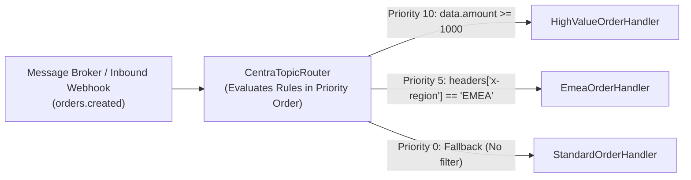

# Pub/Sub Messaging & CNCF CloudEvents v1.0

> Publish and subscribe to events across microservices using CNCF CloudEvents v1.0, consumer groups, dead lettering, and ambient W3C distributed tracing context.

---

## 🎯 Key Concepts

- **`IPubSubClient`**: Unified publishing client wrapping payloads into CloudEvents.
- **`IEventHandler<T>`**: Strongly typed consumer interface.
- **`[Topic]` Attribute**: Declarative metadata associating handlers with pub/sub component names, topics, dead-letter targets, consumer modes, rule filters, and priority.
- **Dynamic Content-Based Routing**: CEL-style rule expressions and programmatic predicates for selective event dispatch to prioritized handlers.
- **CNCF CloudEvents v1.0**: Standardized envelopes supporting both **Binary Mode** (default zero-alloc) and **Structured Mode**.

---

## 🛠️ Registration

Centra supports two ways to register pub/sub event handlers:

### Option A: Declarative via `[Topic]` Attribute (Automatic Discovery)
Decorate your handler class with `[Topic]` and call `builder.Services.AddCentra()` in `Program.cs`. Centra's assembly scanner automatically discovers and registers all decorated handlers:

```csharp
// 1. Add Centra and scan entry assembly
builder.Services.AddCentra();

// 2. Add provider (e.g. RabbitMQ, Redis, Azure Service Bus, or InMemory)
builder.Services.AddCentraRabbitMQ(options =>
{
    options.HostName = "localhost";
    options.ExchangeName = "centra.events";
});
```

### Option B: Programmatic via `AddCentraEventHandler` Extension (Explicit & Dynamic Overrides)
Use `AddCentraEventHandler<THandler, TEvent>()` to explicitly register a handler or dynamically configure topic names, pub/sub brokers, dead-letter topics, or consumer modes from runtime settings:

```csharp
// 1. Add Pub/Sub building blocks (modular registration adhering to ISP)
builder.Services.AddCentraPubSub();

// 2. Add provider
builder.Services.AddCentraRabbitMQ(options =>
{
    options.HostName = "localhost";
    options.ExchangeName = "centra.events";
});

// 3. Explicit programmatic registration with runtime parameters
builder.Services.AddCentraEventHandler<PaymentNotificationHandler, OrderCreatedEvent>(
    pubSubName: builder.Configuration["PubSub:ComponentName"] ?? "pubsub",
    topic: builder.Configuration["PubSub:OrdersTopic"] ?? "orders.created",
    deadLetterTopic: "orders.created.dlq",
    consumerMode: ConsumerMode.CompetingConsumer);
```

> [!TIP]
> **Precedence & Fallback Rule**: Explicit parameters passed to `AddCentraEventHandler` take precedence and override values declared on the `[Topic]` attribute. Any argument left as `null` falls back to the `[Topic]` attribute on the handler, and if omitted there, to framework defaults.

---

## 📤 Publishing Events

Inject `IPubSubClient` and publish your domain event record:

```csharp
app.MapPost("/checkout", async (CheckoutRequest request, IPubSubClient pubSub) =>
{
    var @event = new OrderCreatedEvent(
        OrderId: $"ord-{Guid.NewGuid():N}"[..12],
        CustomerId: request.CustomerId,
        Amount: request.TotalAmount);

    // Publishes to default pubsub component and "orders.created" topic
    await pubSub.PublishAsync("orders.created", @event);

    return Results.Accepted();
});
```

### Specifying Options & Metadata
You can customize the CloudEvent mode and add enterprise extensions:

```csharp
var options = new PubSubPublishOptions(
    PubSubName: "custom-bus",
    Mode: CloudEventMode.Binary, // Raw bytes body + ce-* headers (fastest)
    Metadata: new Dictionary<string, string>
    {
        ["ce-tenantid"] = "tenant-emea-42",
        ["ce-correlationid"] = correlationId
    });

await pubSub.PublishAsync("orders.created", @event, options);
```

---

## 📥 Subscribing with Pure Handlers

Implement `IEventHandler<T>` and decorate your class with `[Topic]`:

```csharp
using Centra.Events;
using Centra.PubSub;

[Topic(
    PubSubName = "pubsub", 
    Topic = "orders.created", 
    DeadLetterTopic = "orders.created.dlq",
    ConsumerMode = ConsumerMode.CompetingConsumer)]
public sealed class PaymentNotificationHandler : IEventHandler<OrderCreatedEvent>
{
    private readonly ILogger<PaymentNotificationHandler> _logger;

    public PaymentNotificationHandler(ILogger<PaymentNotificationHandler> logger)
    {
        _logger = logger;
    }

    public async Task<EventHandlingResult> HandleAsync(
        OrderCreatedEvent @event, 
        EventContext context, 
        CancellationToken cancellationToken)
    {
        _logger.LogInformation("Processing event {EventId} for order {OrderId}. Source: {Source}",
            context.Id, @event.OrderId, context.Source);

        try
        {
            await ProcessPaymentAsync(@event, cancellationToken);
            return EventHandlingResult.Success;
        }
        catch (TransientGatewayException)
        {
            // Requests redelivery / retry from the message broker
            return EventHandlingResult.Retry;
        }
        catch (InvalidOrderException)
        {
            // Moves event directly to DeadLetterTopic
            return EventHandlingResult.DeadLetter;
        }
    }
}
```

### Event Handling Return Statuses:
- **`EventHandlingResult.Success`**: Acknowledges message receipt (`Complete` / `Ack`).
- **`EventHandlingResult.Retry`**: Rejects and returns message to broker for redelivery (`Nack` / `Abandon`).
- **`EventHandlingResult.Drop`**: Silently drops message without retry.
- **`EventHandlingResult.DeadLetter`**: Routes message to dead-letter queue / topic.

---

## ⚡ Consumer Tuning & Extended Subscription Options

Centra provides fine-grained control over message prefetching, concurrency, and queue lifecycle both declaratively via `[Topic]` and programmatically via `PubSubSubscribeOptions`:

| Option | `[Topic]` Attribute | `PubSubSubscribeOptions` | Description |
| :--- | :--- | :--- | :--- |
| **Prefetch Count** | `PrefetchCount = 50` | `PrefetchCount = 50` | Number of unacknowledged messages the broker pushes to the client buffer before waiting for ACKs. In RabbitMQ, configures `BasicQosAsync`. In Azure Service Bus and Redis Streams, governs prefetch buffers and stream batch sizes. |
| **Max Concurrency** | `MaxConcurrentCalls = 4` | `MaxConcurrentCalls = 4` | Maximum number of concurrent handler invocations executed in parallel on a single consumer instance. Managed via `SemaphoreSlim` in RabbitMQ / In-Memory and native processor concurrency in Azure Service Bus. |
| **Message TTL** | `MessageTtlSeconds = 60` | `MessageTimeToLive = TimeSpan.FromMinutes(1)` | Expiration duration for queued messages (`x-message-ttl` in RabbitMQ). |
| **Auto-Delete** | `AutoDelete = true` | `AutoDelete = true` | Automatically destroys the queue when the last consumer disconnects (useful for ephemeral telemetry and test listeners). |
| **Custom Args** | — | `CustomArguments = new Dictionary<string, object?> { ["x-queue-type"] = "quorum" }` | Universal escape hatch for broker-specific queue arguments without breaking vendor neutrality. |

### Example: High-Throughput Worker with Bounded Concurrency

```csharp
[Topic("pubsub", "orders.created",
    PrefetchCount = 50,
    MaxConcurrentCalls = 8,
    MessageTtlSeconds = 300)]
public sealed class OrderProcessorHandler : IEventHandler<OrderCreatedEvent>
{
    public async Task<EventHandlingResult> HandleAsync(OrderCreatedEvent @event, EventContext context, CancellationToken ct)
    {
        await ProcessAsync(@event, ct);
        return EventHandlingResult.Success;
    }
}
```

---

## 🔀 Dynamic & Content-Based Routing (Rule Filters)

Centra allows multiple handlers or distinct routing paths to subscribe to the same pub/sub component and topic. Incoming events can be evaluated against **CEL-style rule expressions** or **programmatic C# predicates**, dispatched to the highest-priority matching handler, and executed within a single, consolidated subscription.

### Architecture: Single Broker Subscription per Topic

In distributed messaging, declaring multiple consumers on the same topic typically results in duplicate message deliveries, competing consumers randomly stealing messages, or ASP.NET Core `AmbiguousMatchException` when mounting duplicate HTTP webhook endpoints.

Centra solves this architecturally:
1. **Consolidated Broker Subscription**: Regardless of how many handlers or routes are configured for a given `(PubSubName, Topic)`, Centra subscribes to the underlying broker (RabbitMQ, Redis, Azure Service Bus, In-Memory) **exactly once**.
2. **Single Endpoint Mapping**: Centra maps a single internal endpoint route `/centra/events/{pubsub}/{topic}`.
3. **Internal Priority-Ordered Dispatch**: Incoming events are dispatched through `CentraTopicRouter`, which evaluates compiled rule filters and predicates in descending priority order (`Priority = 10` before `Priority = 0`).
4. **Subscription Options Merging**: If different handlers specify varying subscription QoS, Centra safely consolidates them (maximum prefetch count, maximum concurrent calls, minimum TTL, and persistent queue retention if any route requests it).



---

### Rule Filter Expression Reference

Rule filter expressions are parsed into an Abstract Syntax Tree (AST) at startup and compiled for zero-reflection, high-throughput evaluation during event delivery.

| Property Scope | Expression Syntax | Description |
| :--- | :--- | :--- |
| **CloudEvent Attributes** | `event.type`, `event.source`, `event.subject`, `event.id`, `event.datacontenttype` | Evaluates top-level CloudEvents v1.0 envelope metadata. |
| **Transport Headers** | `headers['x-custom-key']` | Evaluates ambient headers, AMQP properties, or HTTP headers. |
| **Event Payload Data** | `data.field` or `event.data.nested.field` | Traverses JSON payload properties. |

#### Supported Operators & Functions

- **Equality & Comparison**: `==`, `!=`, `<`, `<=`, `>`, `>=`
- **Logical Operators**: `&&`, `||`, `!` (with standard precedence and grouping via `(...)`)
- **String Functions**:
  - `startsWith(property, 'prefix')`
  - `endsWith(property, 'suffix')`
  - `contains(property, 'substring')`
- **Set Membership**:
  - `property in ['value1', 'value2', 'value3']`
- **Literal Types**: Strings (`'text'`), Numbers (`100`, `99.95`), Booleans (`true`, `false`), and `null`.

> [!TIP]
> **Zero-Allocation Payload Bypass**: The compiler detects `RequiresDataPayload`. If all rule filters on a topic inspect only CloudEvent envelope attributes or headers (e.g., `event.type == 'orders.v2' && headers['x-tier'] == 'gold'`), Centra completely skips parsing the JSON payload into a `JsonDocument`, ensuring zero heap allocation during routing.

---

### Declarative Routing via `[Topic]`

Apply `RuleFilter` and `Priority` directly to your handler implementations:

```csharp
[Topic("orders-pubsub", "orders.created", 
    RuleFilter = "data.totalAmount >= 1000", 
    Priority = 10)]
public sealed class HighValueOrderHandler : IEventHandler<OrderCreatedEvent>
{
    public async Task<EventHandlingResult> HandleAsync(OrderCreatedEvent @event, EventContext context, CancellationToken ct)
    {
        // Handles orders with TotalAmount >= $1,000
        return EventHandlingResult.Success;
    }
}

[Topic("orders-pubsub", "orders.created", Priority = 0)]
public sealed class StandardOrderHandler : IEventHandler<OrderCreatedEvent>
{
    public async Task<EventHandlingResult> HandleAsync(OrderCreatedEvent @event, EventContext context, CancellationToken ct)
    {
        // Fallback default handler for all other orders
        return EventHandlingResult.Success;
    }
}
```

---

### Programmatic Dynamic Routing & Typed Predicates

For dynamic configuration from external settings or strongly-typed C# predicate evaluation, use the `AddCentraEventHandler` overloads:

```csharp
// 1. Route using CEL-style expression from configuration:
builder.Services.AddCentraEventHandler<RegionOrderHandler, OrderCreatedEvent>(
    pubSubName: "orders-pubsub",
    topic: "orders.created",
    ruleFilter: "headers['x-region'] == 'EU-WEST'",
    priority: 20);

// 2. Route using a strongly typed C# predicate:
builder.Services.AddCentraEventHandler<VipCustomerOrderHandler, OrderCreatedEvent>(
    pubSubName: "orders-pubsub",
    topic: "orders.created",
    priority: 15,
    predicate: (@event, context) => @event.TotalAmount >= 500 && @event.CustomerId.StartsWith("VIP-"));

// 3. Fallback route (Priority 0, no filter):
builder.Services.AddCentraEventHandler<StandardOrderHandler, OrderCreatedEvent>(
    pubSubName: "orders-pubsub",
    topic: "orders.created",
    priority: 0);
```

#### Routing Resolution Order
1. Handlers are evaluated in descending order of `Priority` (highest priority evaluated first).
2. For each handler, its `RuleFilter` (if defined) and its `Predicate` (if defined) must both evaluate to `true`.
3. The first route whose filter evaluates to `true` handles the event.
4. If no filtered route matches, Centra executes the default route (the route with no filter or predicate, if configured).
5. If no route matches and no default route exists, the event is safely acknowledged and dropped without error.

---

## 🔗 Ambient W3C TraceContext Propagation

When an event is published, Centra injects the current W3C `traceparent` and `tracestate` into the CloudEvent headers or AMQP properties.

When the subscriber handler runs, Centra automatically:
1. Extracts `traceparent` and `tracestate`.
2. Starts an OpenTelemetry activity (`ActivityKind.Consumer`) with the publisher as parent.
3. Propagates the ambient context into your ASP.NET Core `HttpContext` and downstream service calls.
