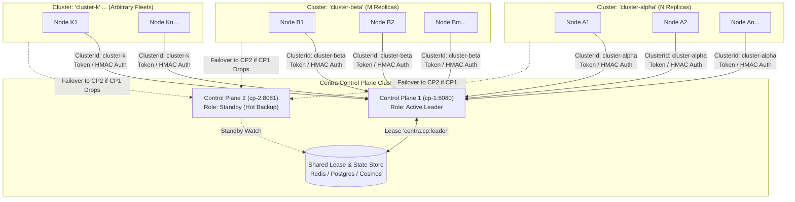

# Centra Control Plane Expansion: Multi-Cluster, HA Failover, High-Performance, Rogue Node Defense & Cluster Formation Guide

## Goal Description

Expand the Centra Control Plane (`Centra.ControlPlane`) from a single-app configuration server into a multi-cluster, high-availability, zero-trust coordination brain engineered for **ultra-fast execution speeds**, **resilience against node failures**, and **generic multi-cluster scalability**:
1. **Arbitrary Multi-Cluster Serving ($N$ Clusters)**: A single Control Plane cluster serves any number of independent, heterogeneous application clusters simultaneously ($C_1, C_2, \dots, C_N$). Each cluster maintains isolated topology tracking, distinct consistent hash ring boundaries for actors, and scoped component/resilience catalogs without cross-talk.
2. **High Availability & Rapid Active-Passive Failover**: Run multiple Control Plane replicas with **strictly one active leader at a time**. If the active leader fails, standby replicas detect lease loss and promote within $\le 2\text{ seconds}$. Client nodes across all connected clusters seamlessly fail over across configured endpoints with zero downtime.
3. **Ultra-Fast Performance & Zero-Allocation Hot Paths**: Sub-millisecond heartbeat processing, lock-free concurrency, pre-serialized zero-copy SSE broadcasts, and stackalloc cryptographic HMAC validation across high-density multi-cluster fleets.
4. **Data Plane Survivability**: Complete decoupling between Control Plane and Data Plane. If all Control Plane nodes are briefly down, application business traffic (RPC, Virtual Actors, Pub/Sub, State) across all clusters continues running at 100% throughput without interruption.
5. **Rogue Node Defense & Dynamic Cluster Admission**: Cryptographic node-bound HMAC signatures, replay prevention, and address attestation to prevent unauthorized nodes from joining any cluster.
6. **HIPAA & PHI Compliance Boundary**: 0 bytes of PHI traverse the Control Plane; workflow history payload redaction protects audit boundaries across all workloads.
7. **Cluster Formation Configuration & Operations Guide**: Complete documentation and exact configuration schemas for deploying an HA Control Plane cluster and onboarding any arbitrary application cluster fleet.

---

## 🌐 Generic Multi-Cluster Architecture ($N$ Clusters)

### 1. Multi-Cluster Topology Model

The Control Plane acts as a centralized coordination brain across any number of independent clusters ($N \ge 1$):



### 2. Multi-Cluster Isolation Guarantees

1. **Topology Partitioning**:
   - Every node registers under a `(ClusterId, AppId, InstanceId)` tuple.
   - `GET /api/v1/topology?clusterId={clusterId}` returns strictly the active nodes within that designated cluster.
   - A cluster only receives topology notifications and SSE stream diffs for its own membership.
2. **Virtual Actor Ring Boundaries**:
   - Consistent hash rings in `CentraActorServiceCollectionExtensions` partition strictly by **both** `ClusterId` and `AppId`.
   - Node membership in Cluster $A$ never pollutes or alters the actor placement hash ring of Cluster $B$.
3. **Component Catalog & Secrets Sandboxing**:
   - Components declared in the catalog can be **Global** (`ClusterId = null`, available to all clusters) or **Cluster-Scoped** (`ClusterId = "cluster-alpha"`).
   - Sensitive infrastructure secrets resolved via `IControlPlaneSecretResolver` are strictly delivered only to nodes authenticated for that specific cluster.
4. **Dynamic Cluster Admission**:
   - New clusters can join at runtime without requiring Control Plane code changes or restarts.
   - Supported security models:
     - **Static Map**: Explicit token per cluster (`ClusterTokens["cluster-alpha"] = "..."`).
     - **Dynamic Token Validator / Issuer**: Pluggable `IClusterAdmissionValidator` verifying signed JWTs, HMAC tokens, or shared cluster roots of trust.

---

## 🛠️ Cluster Formation & Deployment Operations Guide

### 1. Step-by-Step Cluster Bootstrapping

#### Step 1: Deploy Shared State & Distributed Lease Infrastructure
The Control Plane replicas require a shared distributed lock store to coordinate leadership:
- **Redis**: Key `centra:cp:leader` with 4-second TTL.
- **PostgreSQL / SQL Server**: Lease record in `centra_distributed_locks` table.

#### Step 2: Deploy Control Plane Replica 1 (`cp-1`)
Start `cp-1` with public address `http://cp-1:8080`:
```bash
dotnet run --project src/Centra.ControlPlane --urls "http://0.0.0.0:8080"
```
On boot:
1. `ControlPlaneLeaderElectionHostedService` acquires lease `centra:cp:leader`.
2. `cp-1` transitions to `Role = Active` (`IsLeader = true`).
3. `cp-1` accepts heartbeats and serves sync streams for all clusters.

#### Step 3: Deploy Control Plane Replica 2 (`cp-2`)
Start `cp-2` with public address `http://cp-2:8081`:
```bash
dotnet run --project src/Centra.ControlPlane --urls "http://0.0.0.0:8081"
```
On boot:
1. `cp-2` attempts lease acquisition, detects active lease held by `cp-1`, and enters `Role = Standby`.
2. `cp-2` records `LeaderEndpoint = "http://cp-1:8080"`.
3. Non-health requests to `cp-2` receive `307 Temporary Redirect` pointing to `cp-1`.

#### Step 4: Health & Cluster Formation Verification
Run diagnostic health checks against both nodes:

```bash
# Check cp-1 (Active Leader)
curl -i http://localhost:8080/api/v1/health

# HTTP/1.1 200 OK
# X-Centra-Role: Active
# {"status":"Healthy","role":"Active","isLeader":true}

# Check cp-2 (Standby)
curl -i http://localhost:8081/api/v1/health

# HTTP/1.1 200 OK
# X-Centra-Role: Standby
# X-Centra-Leader: http://localhost:8080
# {"status":"Healthy","role":"Standby","isLeader":false,"leaderEndpoint":"http://localhost:8080"}
```

---

### 2. Joining Any Arbitrary Application Cluster

Any application cluster connects by providing:
1. `Endpoints`: List of Control Plane replicas (`["http://cp-1:8080", "http://cp-2:8081"]`).
2. `ClusterId`: The unique name of the cluster (`"billing-cluster"`, `"telemetry-cluster"`, etc.).
3. `ClusterToken`: The pre-shared secret or HMAC key for admission.

#### Verifying Cluster Separation Across $N$ Clusters:
```bash
# Query nodes in Cluster 1
curl -H "X-Centra-Cluster-Token: sec_cluster1_..." \
     "http://localhost:8080/api/v1/topology?clusterId=cluster-1"

# Query nodes in Cluster 2
curl -H "X-Centra-Cluster-Token: sec_cluster2_..." \
     "http://localhost:8080/api/v1/topology?clusterId=cluster-2"
```

---

### 3. Failover Simulation & Operational Recovery

When the active leader fails:
1. **Kill `cp-1`**:
   ```bash
   kill -9 <PID_OF_CP1>
   ```
2. **Lease Expiration & Standby Promotion**:
   - In **2.8 to 4.0 seconds**, the shared lease expires.
   - `cp-2` acquires the lease and promotes to `Role = Active` (`IsLeader = true`).
3. **Client Automatic Reconnection**:
   - All worker nodes across all clusters detect connection loss to `cp-1`.
   - Client SDKs rotate to `http://localhost:8081`.
   - `cp-2` accepts connections, issues a fresh `FullSync` snapshot, and resumes streaming.
4. **Data Plane Unaffected**:
   - Throughout the failover window, RPC calls, actor turns, and messaging across all clusters continue with **zero interruption** using local cached topology.
5. **Leader Re-Joining**:
   - When `cp-1` is restarted, it detects `cp-2` holds the lease and safely assumes the `Standby` role.

---

## 📄 Complete Configuration Reference

### 1. Control Plane Configuration (`appsettings.json` on `Centra.ControlPlane`)

```json
{
  "Logging": {
    "LogLevel": {
      "Default": "Information",
      "Centra.ControlPlane": "Debug"
    }
  },
  "Centra": {
    "ControlPlane": {
      "Leadership": {
        "Enabled": true,
        "PublicEndpoint": "http://cp-1:8080",
        "LeaseDuration": "00:00:04",
        "RenewInterval": "00:00:01.200",
        "LockStoreName": "lockstore",
        "LockResource": "centra:controlplane:leader"
      },
      "Security": {
        "Enabled": true,
        "RequireHmacSignature": true,
        "RequireRemoteIpMatch": false,
        "EnableReverseHealthProbe": false,
        "RedactWorkflowData": true,
        "AllowedClockDrift": "00:00:30",
        "ClusterTokens": {
          "cluster-1": "sec_cluster1_9f8d7c1e5a3b4c6d7e8f0a1b2c3d4e5f",
          "cluster-2": "sec_cluster2_8a7b6c5d4e3f2a1b0c9d8e7f6a5b4c3d"
        },
        "AdminToken": "adm_supersecret_admin_token_99999"
      }
    }
  },
  "ConnectionStrings": {
    "redis": "localhost:6379"
  }
}
```

---

### 2. Application Node Configuration (`appsettings.json` on Any Cluster Node)

```json
{
  "Centra": {
    "AppId": "my-service",
    "ControlPlane": {
      "Endpoints": [
        "http://cp-1:8080",
        "http://cp-2:8081"
      ],
      "ClusterId": "my-custom-cluster",
      "ClusterToken": "sec_my_custom_cluster_token_...",
      "UseHmacAuthentication": true,
      "HeartbeatInterval": "00:00:05",
      "EnableLiveSync": true
    }
  }
}
```

#### Programmatic C# Registration:
```csharp
builder.Services.AddCentra(options =>
{
    options.AppId = "my-service";
    options.ControlPlane.ClusterId = "my-custom-cluster";
    options.ControlPlane.ClusterToken = builder.Configuration["Centra:ControlPlane:ClusterToken"];
    options.ControlPlane.UseHmacAuthentication = true;
    options.ControlPlane.Endpoints = new[]
    {
        "http://cp-1:8080",
        "http://cp-2:8081"
    };
});
```

---

## ⚡ Ultra-Fast Performance Architecture

### 1. Zero-Allocation Heartbeat Ingestion (`POST /api/v1/heartbeat`)

In multi-cluster environments with large replica counts:
- **Lock-Free Concurrent Memory Model**:
  - `InMemoryTopologyTracker` uses `ConcurrentDictionary<CompositeClusterKey, ClientNodeInfo>` where `CompositeClusterKey` is a `readonly record struct CompositeClusterKey(string ClusterId, string AppId, string InstanceId)` implementing `IEquatable<CompositeClusterKey>`.
  - Eliminates string allocations on every heartbeat turn.
- **Source-Generated JSON Deserialization**:
  - Deserialization uses compile-time System.Text.Json source generators (`ControlPlaneJsonSerializerContext`), completely eliminating runtime reflection overhead.
- **Stackalloc Zero-Allocation HMAC Verification**:
  - Signatures are computed directly on the stack:
    ```csharp
    Span<byte> hashBuffer = stackalloc byte[32]; // 256 bits
    HMACSHA256.HashData(clusterSecretSpan, payloadSpan, hashBuffer);
    return CryptographicOperations.FixedTimeEquals(hashBuffer, expectedSignatureSpan);
    ```
  - **Zero heap allocations** for cryptographic validation on every heartbeat request.
- **Asynchronous Coalesced State Store Flushes**:
  - Heartbeats update in-memory state instantly and coalesce writes into a high-throughput channel-backed worker, flushing micro-batches (e.g. every 250ms) to prevent database write amplification.

---

### 2. Pre-Serialized SSE Broadcasting ("Serialize Once, Deliver to Thousands")

- Event payloads are serialized **exactly once** into a pooled UTF-8 byte buffer via `PooledByteBufferWriter`.
- The pre-encoded buffer (`ReadOnlyMemory<byte>`) is broadcast directly to all active subscriber `PipeWriter` / `Stream` channels.
- CPU serialization cost is $O(1)$ regardless of how many clusters or nodes are connected.

---

## 🛡️ High Resilience: Outage Resilience & Data Plane Survivability

### 1. Data Plane Survivability (Zero Impact on Running Applications)

> [!IMPORTANT]
> **A complete Control Plane outage NEVER halts running microservices.**
> Steady-state application traffic is fully decoupled from the Control Plane:
> - `CentraServiceInvoker` routes RPC calls directly to peers using its cached local topology snapshot.
> - `ActorPlacementDirector` places virtual actor turns against its existing consistent hash ring.
> - `CentraPubSubClient` and `CentraStateStore` communicate directly with brokers and databases.
> - Microservices log heartbeat retries silently and continue processing user requests at 100% throughput.

---

### 2. Ultra-Fast Active-Passive Failover ($\le 2\text{ Seconds}$)

- **Aggressive Lease Configuration**: Lease Duration: **4.0 seconds**, Renewal Interval: **1.2 seconds**.
- **Instant Standby Redirects**: Standby nodes return `307 Temporary Redirect` in $<1\text{ ms}$.
- **Client Auto-Reconnect & Snapshot Reconciliation**: Clients detect socket loss, rotate to secondary endpoint with jittered backoff (150ms initial retry), and receive an immediate `FullSync` snapshot upon reconnection.
- **Zero False Node Evictions**: Node stale timeout defaults to 30 seconds, so a 2-second Control Plane failover causes zero false node drops or hash ring churn across any cluster.

---

## 🔒 Rogue Node Defense & Cluster Join Security

| Threat Vector | Mitigation Mechanism |
| :--- | :--- |
| **No token / invalid token** | Rejected at API filter with `401 Unauthorized` / `403 Forbidden`. |
| **Cross-cluster token reuse** | Cryptographic cluster keys are partitioned; tokens fail signature validation across clusters. |
| **Token interception & replay** | Timestamps (max 30s drift) + 60s nonce cache invalidate replayed requests. |
| **Node impersonation / spoofing** | Signature binds to specific `(ClusterId, AppId, InstanceId)`. |
| **Traffic hijacking / fake IP** | Socket IP attestation matches reported address; reverse challenge probe verifies node identity. |
| **Secret eavesdropping** | SSE streams and catalog queries are strictly filtered by authenticated `ClusterId`. |

---

## 🛡️ HIPAA Compliance & PHI Data Flow Boundary

| Application Operation | Data Carried | Traffic Path | Touches Control Plane? | HIPAA Audit Scope |
| :--- | :--- | :--- | :--- | :--- |
| **Service Invocation (RPC)** | Patient records, clinical notes, claims, diagnostic data (**PHI**) | **Direct Peer-to-Peer** | **NO (0 bytes)** | **Data Plane Only** |
| **Virtual Actor Turns** | Patient entity state, turn arguments (**PHI**) | **Local In-Memory** or **Direct Peer-to-Peer RPC** | **NO (0 bytes)** | **Data Plane Only** |
| **Pub/Sub Messaging** | Domain events, patient telemetry, vitals (**PHI**) | **Direct Broker Driver** | **NO (0 bytes)** | **Broker & Data Plane Only** |
| **State Storage** | Patient profiles, medical history (**PHI**) | **Direct Storage Driver** | **NO (0 bytes)** | **Storage & Data Plane Only** |
| **Node Heartbeats** | AppId, InstanceId, Status, Node URI (`http://ip:port`) | App Node -> Control Plane | **YES** (Metadata only) | **Out of PHI Scope** |
| **Workflow State & History** | Workflow activity input/output event data | Control Plane -> Local Engine / State Store | **POTENTIAL RISK** | **Zero PHI via RedactWorkflowData = true** |

---

## Proposed Changes

### Component 1: `Centra.Runtime`

#### [MODIFY] `CentraControlPlaneOptions.cs`
Add generic multi-cluster, multiple endpoints fallback, and performance tuning:

```csharp
namespace Centra;

public sealed class CentraControlPlaneOptions
{
    public string? Endpoint { get; set; }
    public IReadOnlyList<string> Endpoints { get; set; } = [];
    public TimeSpan HeartbeatInterval { get; set; } = TimeSpan.FromSeconds(5);
    public bool EnableLiveSync { get; set; } = true;
    public string ClusterId { get; set; } = "default";
    public string InstanceId { get; set; } = Guid.NewGuid().ToString("N");
    public string? ClusterToken { get; set; }
    public bool UseHmacAuthentication { get; set; } = false;
    public Dictionary<string, string> Metadata { get; set; } = new(StringComparer.OrdinalIgnoreCase);
}
```

#### [MODIFY] `CentraOptions.cs`
Add convenience `ClusterId` accessor.

---

### Component 2: `Centra.Sync.Abstractions`

#### [MODIFY] `ServiceNodeDto.cs`
Add `ClusterId` property:

```csharp
namespace Centra.Sync;

public sealed record ServiceNodeDto(
    string AppId,
    string InstanceId,
    string Status,
    DateTimeOffset RegisteredAtUtc,
    DateTimeOffset LastHeartbeatUtc,
    IReadOnlyDictionary<string, string>? Metadata,
    string ClusterId = "default");
```

#### [MODIFY] `IControlPlaneClient.cs`
Add generic cluster-aware methods and overload support.

---

### Component 3: `Centra.ControlPlane`

#### [NEW] `Security/ControlPlaneSecurityOptions.cs`
Configuration options for tokens, HMAC validation, IP checks, reverse probe, and workflow redaction.

#### [NEW] `Security/IClusterAdmissionValidator.cs`
Validation abstraction.

#### [NEW] `Security/ClusterAdmissionResult.cs`
Result record with `Success`, `StatusCode`, `ErrorMessage`.

#### [NEW] `Security/ClusterAdmissionValidator.cs`
High-performance zero-allocation implementation with constant-time comparison, stackalloc HMAC-SHA256, and replay cache.

#### [NEW] `Security/ClusterAuthenticationEndpointFilter.cs`
ASP.NET Core endpoint filter applying admission checks.

#### [NEW] `HA/ControlPlaneLeadershipOptions.cs`
Fast failover configuration (`LeaseDuration = 4s`, `RenewInterval = 1.2s`, `PublicEndpoint`).

#### [NEW] `HA/IControlPlaneLeaderTracker.cs`
Tracks current leadership state (`IsLeader`, `LeaderEndpoint`).

#### [NEW] `HA/ControlPlaneLeaderTracker.cs`
Thread-safe volatile leader tracker.

#### [NEW] `HA/ControlPlaneLeaderElectionHostedService.cs`
Background service running leader acquisition and lease renewal with sub-second resilience.

#### [NEW] `HA/ControlPlaneLeadershipEndpointFilter.cs`
Returns `307 Temporary Redirect` on standby instances in $<1\text{ ms}$.

#### [NEW] `Topology/CompositeClusterKey.cs`
Readonly record struct key for lock-free sharded dictionary indexing across $N$ clusters.

#### [MODIFY] `Topology/HeartbeatRequest.cs`
Add `string ClusterId = "default"` property.

#### [MODIFY] `Topology/ITopologyTracker.cs`
Add `clusterId` filtering.

#### [MODIFY] `Topology/InMemoryTopologyTracker.cs`
Zero-allocation lock-free index by `CompositeClusterKey`.

#### [MODIFY] `Topology/StateStoreTopologyTracker.cs`
Persist nodes partitioned by `ClusterId` with batched coalesced writes.

#### [MODIFY] `Sync/ComponentSyncDispatcher.cs`
Broadcast pre-serialized UTF-8 byte buffers to connected subscribers.

#### [MODIFY] `Endpoints/ControlPlaneEndpoints.cs`
Apply filters and enforce `RedactWorkflowData`.

---

### Component 4: `Centra.Sync`

#### [NEW] `Sync/ControlPlaneEndpointSelector.cs`
Manages failover across multiple Control Plane endpoints.

#### [NEW] `Sync/ControlPlaneSecurityHeadersHandler.cs`
Delegating handler computing zero-allocation stackalloc HMAC-SHA256 signatures and bearer headers.

#### [MODIFY] `Sync/ControlPlaneClient.cs`
Integrate security headers and failover.

#### [MODIFY] `HostedServices/CentraControlPlaneSyncHostedService.cs`
Pass `_options.ControlPlane.ClusterId`.

#### [MODIFY] `Sync/ClusterTopologyProviderHostedService.cs`
Filter topology by cluster.

---

### Component 5: `Centra.Actors`

#### [MODIFY] `Extensions/CentraActorServiceCollectionExtensions.cs`
Ensure consistent hash ring partitions strictly by **both** `localClusterId` and `localAppId`.

### Component 6: Embedded Angular Dashboard & Datadog Telemetry (`Centra.ControlPlane`)

#### [NEW] `Dashboard/ControlPlaneDashboardOptions.cs`
Configuration options to enable/disable the dashboard, configure base path (`/dashboard`), and set RBAC policies.

#### [NEW] `Dashboard/ControlPlaneDashboardEndpointExtensions.cs`
Maps `/dashboard` route and serves embedded static Angular single-page application assets with SPA fallback routing.

#### [NEW] `ui/dashboard/*`
Angular Standalone Single-Page Application (SPA) leveraging Angular Signals, standalone components, and native SSE (`EventSource`) for real-time reactivity without process overhead. Builds into `src/Centra.ControlPlane/wwwroot/dashboard/`.

#### [MODIFY] `Diagnostics/ControlPlaneMeters.cs`
Add Datadog-ready metrics:
- `centra.controlplane.leader.is_leader` (Gauge: 1 for active, 0 for standby)
- `centra.controlplane.leader.lease_time_remaining` (Gauge in seconds)
- `centra.controlplane.heartbeats.latency` (Histogram in ms)
- `centra.controlplane.nodes.active` (UpDownCounter by cluster)
- `centra.controlplane.security.admission.rejected` (Counter by cluster and reason)

#### [MODIFY] `Program.cs`
Configure Datadog Unified Service Tagging (`service`, `env`, `version`), standard OTLP gRPC/HTTP exporter, and correlated structured logging.

---

### Component 7: Documentation

#### [NEW] `docs/architecture/control-plane-dashboard-recommendations.md`
Comprehensive architectural design for the Angular Standalone Dashboard, Datadog full-stack telemetry integration, Datadog monitors/alerts, and HIPAA safeguards.

#### [NEW] `docs/operations/control-plane-cluster-formation.md`
Operational guide covering multi-cluster architecture, bootstrapping, curl recipes, and failover.

#### [MODIFY] `docs/operations/control-plane.md`
Cross-link to cluster formation guide, dashboard documentation, and document multi-cluster and security endpoints.

#### [MODIFY] `docs/operations/configuration-reference.md`
Document new `ControlPlane:Leadership`, `ControlPlane:Security`, and `ControlPlane:Dashboard` properties.

---

## Verification Plan

### Automated Tests

1. **Unit Tests (`tests/Centra.ControlPlane.Tests.Unit`)**:
   - `ClusterAdmissionValidatorTests`: Missing tokens, wrong tokens, valid PSK, valid HMAC, replay detection, IP mismatch.
   - `MultiClusterTopologyTests`: Verify arbitrary clusters ($C_1, C_2, C_3$) register independently and topology queries for $C_1$ never leak nodes from $C_2$.
   - `ControlPlaneLeadershipTests`: Standby returns 307 redirect, lease expiry triggers promotion in $\le 2\text{s}$.
   - `WorkflowHistoryRedactionTests`: Verify `RedactWorkflowData` scrubs byte payloads.
   - `HighThroughputHeartbeatBenchmark`: 10,000 heartbeats across multiple clusters execute with zero memory leak and sub-millisecond per-op latency.

2. **Unit Tests (`tests/Centra.Tests.Unit`)**:
   - `ControlPlaneClientFailoverTests`: Automatic rotation across endpoints on primary failure.
   - `ActorPlacementMultiClusterTests`: Consistent hash rings never cross cluster boundaries across arbitrary cluster pairs.

3. **Regression Execution**:
   ```bash
   dotnet test Centra.slnx --filter "Category!=Integration"
   ```

### Manual Verification

1. Start two Control Plane instances (`cp-1` on port 8080, `cp-2` on port 8081) with shared Redis lock store.
2. Verify `cp-1` acquires leadership, while `cp-2` reports `Standby` and redirects requests to `cp-1`.
3. Launch replicas across multiple distinct clusters (`cluster-1`, `cluster-2`, `cluster-3`).
4. Kill `cp-1` with `kill -9`; observe `cp-2` assuming leadership within 2 seconds.
5. Verify client nodes in all clusters reconnect seamlessly to `cp-2` with zero dropped requests.
