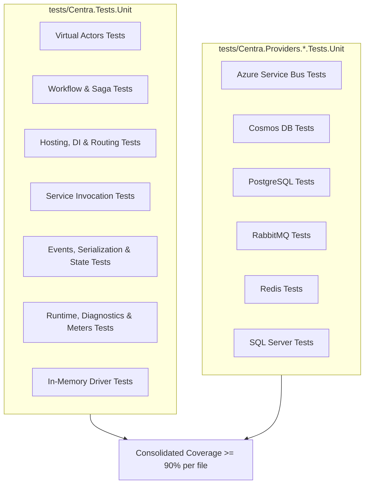

# Implementation Plan: 90%+ Code Coverage Across All Files

## Goal Description
Identify and create covering unit tests for all 67 files in the codebase currently measuring below the 90% line coverage threshold. This will elevate overall repository coverage from 79.1% to well over 92%+, eliminating untested branches, error handling blocks, and newly extracted architecture components while enforcing strict zero-allocation and single-responsibility standards.

---

## User Review Required

> [!IMPORTANT]
> All new tests are architected as fast, deterministic **Unit Tests** (no Docker/Testcontainers required for running unit tests). Mocks are established using `NSubstitute` against abstractions and virtual SDK types (`CosmosClient`, `Container`, `ServiceBusClient`, `IConnectionMultiplexer`, `IChannel`).

> [!NOTE]
> All tests conform to the repo's single responsibility rule (`File per Type`), zero warnings under `<TreatWarningsAsErrors>true</TreatWarningsAsErrors>`, and Central Package Management.

---

## Baseline Coverage Status (Files < 90%)

An initial test run with OpenCover and ReportGenerator identified 67 classes/files with less than 90% line coverage:

| Component Area | Files < 90% | Lowest Coverage Items | Target Coverage |
|---|---|---|---|
| **Virtual Actors** | 9 | `Md5ConsistentHashAlgorithm` (70.5%), `ActorMailbox` (74.6%), `ActorReminderLockCoordinator` (76.1%), `ActorStatePersister` (78.6%), `ActorStateManager` (81.6%), `ActorDispatchMethodMetadata` (83.0%), `ActorManager` (86.2%), `ActorDispatchProxy` (89.6%), `ActorConcurrencyException` (50.0%) | ≥ 95% |
| **Workflows & Sagas** | 8 | `WorkflowRunnerInvoker` (33.6%), `WorkflowActivityMethodInvoker` (51.5%), `WorkflowInputConverter` (73.6%), `WorkflowSaga` (80.3%), `WorkflowEngine` (85.3%), `WorkflowTimerScheduler` (86.0%), `WorkflowActivityDispatcher` (88.8%), `WorkflowInstanceId` (87.5%) | ≥ 95% |
| **Hosting, Routing & DI** | 10 | `CentraStateServiceCollectionExtensions` (42.8%), `CentraControlPlaneSyncHostedService` (69.5%), `CentraAttributeScanner` (75.7%), `CentraStateStoreRegistrationHelper<T>` (77.7%), `CentraTopicRegistration` (78.5%), `CentraActorHostedService` (81.2%), `ActorEndpointMethodInvoker` (81.2%), `CentraEndpointRouteBuilderExtensions` (82.2%), `CentraRuntimeHostedService` (83.7%), `CentraWorkflowHostedService` (85.7%) | ≥ 95% |
| **Service Invocation** | 2 | `CentraDispatchMethodMetadata` (61.9%), `ServiceProxyFactory` (89.4%) | 100% |
| **Events & Serialization** | 2 | `CloudEventPacker` (84.6%), `JsonCentraSerializer` (82.8%) | 100% |
| **State & Locks Abstractions** | 3 | `CentraStateStore` (83.7%), `CentraStateStore<T>` (77.7%), `IDistributedLockProvider` (0.0%) | 100% |
| **Runtime, Sync & Resilience** | 4 | `CentraDiagnostics` (80.5%), `CentraMeters` (84.8%), `ResilienceTelemetryListener` (85.3%), `ClusterTopologyProviderHostedService` (76.7%) | 100% |
| **In-Memory Provider** | 4 | `InMemoryPubSubDriver` (81.4%), `InMemoryDistributedLock` (82.3%), `InMemoryStateStoreDriver` (83.5%), `InMemoryDistributedLockDriver` (86.0%) | ≥ 95% |
| **Azure Service Bus Provider** | 4 | `ServiceBusMessageSettler` (3.7%), `ServiceBusHeaderExtractor` (4.3%), `AzureServiceBusPubSubDriver` (12.7%), `CentraAzureServiceBusServiceCollectionExtensions` (87.5%) | ≥ 90% |
| **Cosmos DB Provider** | 4 | `CosmosDbDistributedLock` (0.0%), `CosmosDbStateStoreDriver` (2.5%), `CosmosDbDistributedLockDriver` (6.2%), `CentraCosmosDbServiceCollectionExtensions` (89.5%) | ≥ 90% |
| **PostgreSQL Provider** | 4 | `PostgreSqlDelegateComponentInitializer` (0.0%), `CentraPostgreSqlServiceCollectionExtensions` (21.2%), `PostgreSqlDistributedLock` (85.0%), `PostgreSqlStateStoreDriver` (85.8%) | ≥ 90% |
| **RabbitMQ Provider** | 5 | `RabbitMQDelegateComponentInitializer` (0.0%), `CentraRabbitMQServiceCollectionExtensions` (35.4%), `RabbitMQHeaderExtractor` (68.4%), `RabbitMQPubSubDriver` (79.7%), `RabbitMQMessageAcknowledger` (80.0%) | ≥ 90% |
| **Redis Provider** | 5 | `RedisDelegateComponentInitializer` (0.0%), `RedisStreamProcessor` (1.3%), `CentraRedisServiceCollectionExtensions` (17.5%), `RedisPubSubKeyFormatter` (50.0%), `RedisPubSubDriver` (62.2%) | ≥ 90% |
| **SQL Server Provider** | 3 | `SqlServerStateStoreDriver` (85.0%), `CentraSqlServerServiceCollectionExtensions` (86.1%), `SqlServerDistributedLock` (87.7%) | ≥ 90% |

---

## Proposed Changes



---

### Phase 1: Core Framework Unit Tests (`tests/Centra.Tests.Unit`)

#### 1. Virtual Actors
- #### [NEW] `tests/Centra.Tests.Unit/Actors/Md5ConsistentHashAlgorithmTests.cs`
  - Test short keys (<= 256 bytes) and long keys (> 256 bytes) triggering heap fallback.
  - Test null check throwing `ArgumentNullException`.
- #### [NEW] `tests/Centra.Tests.Unit/Actors/ActorMailboxEdgeCaseTests.cs`
  - Test `EnqueueTurnAsync` when already disposed throws `ObjectDisposedException`.
  - Test `EnqueueTurnAsync` with pre-canceled `CancellationToken`.
  - Test `DrainAsync` timeout returning false.
  - Test mailbox shutdown cancel draining remaining items in channel.
- #### [NEW] `tests/Centra.Tests.Unit/Actors/ActorStatePersisterTests.cs`
  - Test `Modified` entry with empty ETag (blind overwrite fallback).
  - Test `Deleted` entry with empty ETag (blind delete).
  - Test `Deleted` entry with optimistic concurrency conflict throwing `ActorConcurrencyException`.
  - Test `RefreshETagAsync` when item no longer exists.
  - Test null/whitespace validation on key/stateName.
- #### [NEW] `tests/Centra.Tests.Unit/Actors/ActorStateManagerExtendedTests.cs`
  - Test `GetStateAsync` when cached status is `Deleted` returning default.
  - Test `SetStateAsync` modifying an existing non-Added entry (`Status = Modified`).
  - Test `TrySetStateAsync`.
  - Test `RemoveStateAsync` on cached `Deleted` (returns false), cached `Added` (removes from cache), and non-existent stored key.
  - Test `ContainsStateAsync` on cached `Deleted` and non-existent.
  - Test `ClearCacheAsync` and whitespace validation.
- #### [NEW] `tests/Centra.Tests.Unit/Actors/ActorReminderLockCoordinatorTests.cs`
  - Test `TryAcquireReminderLockAsync` handling `InvalidOperationException` from lock store not configured (returns true, null).
- #### [NEW] `tests/Centra.Tests.Unit/Actors/ActorDispatchMethodMetadataTests.cs`
  - Test methods returning `ValueTask`, `ValueTask<T>`, `Task`, `Task<T>`, and unsupported return type (`int`, `void`) throwing `NotSupportedException`.
  - Test local and remote dispatch invocations for `ValueTask` and `ValueTask<T>`.
- #### [NEW] `tests/Centra.Tests.Unit/Actors/ActorManagerPassivationTests.cs`
  - Test `PassivateIdleActorsAsync` edge cases, missing actor type, and unregistering actors.
- #### [NEW] `tests/Centra.Tests.Unit/Actors/ActorConcurrencyExceptionTests.cs`
  - Test constructor with `innerException` overload and property assertions.

#### 2. Workflows & Distributed Sagas
- #### [NEW] `tests/Centra.Tests.Unit/Workflows/WorkflowRunnerInvokerTests.cs`
  - Test workflow with `ValueTask` (void) RunAsync.
  - Test workflow with `Task` (void) RunAsync.
  - Test workflow with `ValueTask<T>` RunAsync.
  - Test workflow with synchronous RunAsync.
  - Test workflow missing RunAsync method throwing `InvalidOperationException`.
  - Test workflow throwing exception and unwrapping `TargetInvocationException`.
- #### [NEW] `tests/Centra.Tests.Unit/Workflows/WorkflowActivityMethodInvokerTests.cs`
  - Test activity with `ValueTask` (void) RunAsync.
  - Test activity with `Task` (void) RunAsync.
  - Test activity with `ValueTask<T>` RunAsync.
  - Test activity with synchronous RunAsync.
  - Test activity missing RunAsync method throwing `InvalidOperationException`.
  - Test activity throwing exception and unwrapping `TargetInvocationException`.
- #### [NEW] `tests/Centra.Tests.Unit/Workflows/WorkflowInputConverterTests.cs`
  - Test null input with value type target type (e.g. `int` returning 0).
  - Test `ReadOnlyMemory<byte>` deserialization.
  - Test `ArgumentNullException` checks.
- #### [NEW] `tests/Centra.Tests.Unit/Workflows/WorkflowSagaTests.cs`
  - Test empty compensations early exit.
  - Test generic `AddCompensation<TActivity, TInput>`.
  - Test compensation step failure catching exception and throwing `AggregateException`.
  - Test null/whitespace activity name validation.
- #### [NEW] `tests/Centra.Tests.Unit/Workflows/WorkflowTimerSchedulerTests.cs`
  - Test rescheduling existing timer (disposes existing).
  - Test timer callback throwing exception (handled by logger).
  - Test `CancelTimer` returning false for unknown timer.
  - Test `Dispose()` clearing active timers.
- #### [NEW] `tests/Centra.Tests.Unit/Workflows/WorkflowInstanceIdTests.cs`
  - Test `CompareTo` between different and equal workflow instance IDs.
  - Test string conversions and empty ToString.
- #### [NEW] `tests/Centra.Tests.Unit/Workflows/WorkflowEngineExtendedTests.cs`
  - Test workflow suspended exception, purge workflow, raise event on non-existent or terminated workflow.

#### 3. Hosting, Routing & DI
- #### [NEW] `tests/Centra.Tests.Unit/Hosting/CentraStateServiceCollectionExtensionsTests.cs`
  - Test `AddCentraStateStore<T>` registration and resolving `IStateStore<T>`.
  - Test `CentraStateStoreRegistrationHelper<T>` all 5 method delegations (`GetAsync`, `SetAsync`, `TrySetAsync`, `DeleteAsync`, `TryDeleteAsync`).
- #### [NEW] `tests/Centra.Tests.Unit/Hosting/CentraAttributeScannerTests.cs`
  - Test `ReflectionTypeLoadException` handling.
  - Test `[Topic]` on type not implementing `IEventHandler<T>`.
  - Test `[Workflow]` on abstract class or non-IWorkflow.
  - Test `[WorkflowActivity]` on abstract class.
  - Test `IJobHandler` without `[CronBinding]`.
  - Test `IBindingTriggerHandler` without `[Binding]`.
  - Test `[Actor]` on class implementing 0 or >1 domain actor interfaces throwing `InvalidOperationException`.
- #### [NEW] `tests/Centra.Tests.Unit/Hosting/CentraHostedServicesTests.cs`
  - Test `CentraActorHostedService`: error during tick caught and logged, stop disposing actor manager.
  - Test `CentraWorkflowHostedService`: start, stop, cancellation exception handling.
  - Test `CentraRuntimeHostedService`: missing driver continuing, missing handler returning Drop, exception returning DeadLetter, ambient headers.
  - Test `CentraTopicRegistration`: constructor and properties.
- #### [NEW] `tests/Centra.Tests.Unit/Hosting/CentraControlPlaneSyncHostedServiceTests.cs`
  - Test missing ControlPlane endpoint skipping live sync.
  - Test `GetComponentsAsync` exception handling.
  - Test `GetResiliencePoliciesAsync` exception handling.
  - Test `SendHeartbeatAsync` exception handling.
  - Test `ComponentSyncAction.Removed`.
  - Test `StreamResilienceUpdatesAsync` with policy deletions and backoff types (Constant, Linear).
  - Test `MapFromDto` circuit breaker, timeout, rate limiter, bulkhead mapping.
- #### [NEW] `tests/Centra.Tests.Unit/Hosting/ActorEndpointMethodInvokerTests.cs`
  - Test method not found returning null.
  - Test methods returning `ValueTask`, `ValueTask<T>`, synchronous values.
  - Test parameters with only `CancellationToken`.
  - Test multi-parameter fallback methods.
  - Test empty body with value type parameter.
  - Test target invocation exception unwrapping.
- #### [NEW] `tests/Centra.Tests.Unit/Hosting/CentraEndpointRouteBuilderExtensionsTests.cs`
  - Test `/centra/bindings/{bindingName}` 404 when dispatcher null or no handler, and success with custom content type.
  - Test `/centra/actors/...` 404 when manager null, 404 on MissingMethodException, 500 on Exception.
  - Test `/centra/workflows/{instanceId}/history` and `/raise-event` and `/terminate` and `/centra/workflows/{instanceId}` DELETE.
  - Test `EventHandlingResult.Retry` returning 500.
  - Test request body reading with unknown ContentLength.

#### 4. Service Invocation
- #### [NEW] `tests/Centra.Tests.Unit/Invocation/CentraDispatchMethodMetadataTests.cs`
  - Test service interface method returning `Task` (void).
  - Test service interface method returning `ValueTask` (void).
  - Test service interface method returning `ValueTask<T>`.
  - Test service interface method with no parameters or only `CancellationToken`.
  - Test unsupported return type (`int`, `void`) throwing `NotSupportedException`.
- #### [NEW] `tests/Centra.Tests.Unit/Invocation/ServiceProxyFactoryValidationTests.cs`
  - Test null invoker throwing `ArgumentNullException`.
  - Test non-interface type parameter throwing `InvalidOperationException`.
  - Test interface missing `[ServiceClient]` throwing `InvalidOperationException`.

#### 5. Events, Serialization, State & Locks
- #### [NEW] `tests/Centra.Tests.Unit/Events/CloudEventPackerFullCoverageTests.cs`
  - Test `CentraAmbientContext.CausationId` and `TenantId` propagation in Binary and Structured modes.
  - Test `EventContractAttribute` with `Schema`.
  - Test `additionalMetadata` dictionary inclusion.
- #### [NEW] `tests/Centra.Tests.Unit/Serialization/JsonCentraSerializerTests.cs`
  - Test `Serialize(null, typeof(string))` returning empty array.
  - Test `Deserialize<string>(ReadOnlyMemory<byte>.Empty)` returning default.
  - Test `Deserialize(ReadOnlyMemory<byte>.Empty, typeof(string))` returning null.
  - Test custom `JsonSerializerOptions` constructor.
- #### [NEW] `tests/Centra.Tests.Unit/State/CentraStateStoreExtendedTests.cs`
  - Test `CentraStateStore<T>` constructor null checks and all methods.
  - Test `CentraStateStore` with `options.DisableResilience = true`.
  - Test `NormalizeOperation` handling null value and `ReadOnlyMemory<byte>`.
  - Test `GetDriver` throwing `InvalidOperationException` for unregistered store.
  - Test exceptions in Get/Set/TrySet/Delete/TryDelete/ExecuteTransaction recording error meter.
- #### [NEW] `tests/Centra.Tests.Unit/Locks/DistributedLockProviderDefaultTests.cs`
  - Test `IDistributedLockProvider.AcquireLockAsync` default interface implementation method delegating to `DistributedLockHelper`.

#### 6. Runtime, Diagnostics & Sync
- #### [NEW] `tests/Centra.Tests.Unit/Diagnostics/CentraDiagnosticsFullTests.cs`
  - Test all `CentraDiagnostics.Start*Activity` methods with an active `ActivityListener` having `ActivitySamplingResult.AllDataAndRecorded` to cover all tag sets and branches.
- #### [NEW] `tests/Centra.Tests.Unit/Diagnostics/CentraMetersFullTests.cs`
  - Test every method in `CentraMeters` (`RecordLockAcquisition`, `RecordLockHold`, `RecordResilienceRetry`, `RecordResilienceCircuitTransition`, `RecordResilienceTimeout`, `RecordResilienceRejection`, `RecordBindingInvocation`, `RecordBindingTrigger`, etc.).
- #### [NEW] `tests/Centra.Tests.Unit/Resilience/ResilienceTelemetryListenerTests.cs`
  - Test `OnRetry`, `OnCircuitOpened`, `OnCircuitClosed`, `OnCircuitHalfOpened`, `OnTimeout` with and without active `Activity` and with and without `ILogger`.
- #### [NEW] `tests/Centra.Tests.Unit/Sync/ClusterTopologyProviderHostedServiceTests.cs`
  - Test node removals generating change events.
  - Test exception handling during topology polling.
  - Test cancellation breaking delay loop.

#### 7. In-Memory Provider Drivers
- #### [NEW] `tests/Centra.Tests.Unit/Providers/InMemory/InMemoryPubSubDriverExtendedTests.cs`
  - Test publishing to empty topic.
  - Test dead lettering on `EventHandlingResult.DeadLetter` and when handler throws.
  - Test handler throwing without dead letter topic rethrowing exception.
  - Test `UnsubscribeAsync`.
- #### [NEW] `tests/Centra.Tests.Unit/Providers/InMemory/InMemoryStateStoreDriverExtendedTests.cs`
  - Test TTL expiration in `GetAsync` and `TrySetAsync`.
  - Test `TrySetAsync` with expected ETag when key doesn't exist.
  - Test `TryDeleteAsync` when item doesn't exist or ETag mismatch.
  - Test `ExecuteTransactionAsync` with `DeleteTransactionOperation`.
- #### [NEW] `tests/Centra.Tests.Unit/Providers/InMemory/InMemoryDistributedLockDriverExtendedTests.cs`
  - Test acquiring lock when existing lock expired (updating).
  - Test `RenewLockAsync` returning false for missing or expired lock.
  - Test `RenewAsync` on `InMemoryDistributedLock` after disposed returning false.
  - Test multiple disposals of `InMemoryDistributedLock`.

---

### Phase 2: Provider Test Suites (`tests/Centra.Providers.*.Tests.Unit`)

#### 1. Azure Service Bus (`Centra.Providers.AzureServiceBus.Tests.Unit`)
- #### [NEW] `tests/Centra.Providers.AzureServiceBus.Tests.Unit/PubSub/ServiceBusHeaderExtractorTests.cs`
  - Test `ExtractHeaders` with ApplicationProperties, MessageId, Subject, CorrelationId, ContentType using `ServiceBusModelFactory.ServiceBusReceivedMessage`.
  - Test `CopyHeaderIfPresent` when header already exists or value is null.
- #### [NEW] `tests/Centra.Providers.AzureServiceBus.Tests.Unit/PubSub/ServiceBusMessageSettlerTests.cs`
  - Test `SettleMessageAsync` for Success, Drop, DeadLetter, and Retry (Abandon) using `ServiceBusModelFactory.ProcessMessageEventArgs`.
  - Test `SettleSessionMessageAsync` for Success, Drop, DeadLetter, and Retry.
- #### [NEW] `tests/Centra.Providers.AzureServiceBus.Tests.Unit/PubSub/AzureServiceBusPubSubDriverUnitTests.cs`
  - Test `PublishAsync` creating sender and sending message with mocked `ServiceBusClient` and `ServiceBusSender`.
  - Test `SubscribeAsync`, `UnsubscribeAsync`, dispose, and sender caching.
- #### [MODIFY] `tests/Centra.Providers.AzureServiceBus.Tests.Unit/Extensions/CentraAzureServiceBusServiceCollectionExtensionsTests.cs`
  - Add tests for `AddCentraAzureServiceBusPubSub` and verify delegate initializer registration and component catalog.

#### 2. Cosmos DB (`Centra.Providers.CosmosDb.Tests.Unit`)
- #### [NEW] `tests/Centra.Providers.CosmosDb.Tests.Unit/Locks/CosmosDbDistributedLockTests.cs`
  - Test `RenewAsync` success and `CosmosException` precondition failure/not found using mocked `Container`.
  - Test `DisposeAsync` deleting lock item and suppressing exceptions.
- #### [NEW] `tests/Centra.Providers.CosmosDb.Tests.Unit/Locks/CosmosDbDistributedLockDriverTests.cs`
  - Test `TryAcquireLockAsync` success creating lock document and conflict handling (HTTP 409) using mocked `CosmosClient` and `Container`.
- #### [NEW] `tests/Centra.Providers.CosmosDb.Tests.Unit/State/CosmosDbStateStoreDriverTests.cs`
  - Test `GetAsync` with found document and 404 NotFound.
  - Test `SetAsync` upserting item.
  - Test `TrySetAsync` with ETag matching and precondition conflict (412).
  - Test `DeleteAsync` and `TryDeleteAsync`.
  - Test `ExecuteTransactionAsync` using mocked `TransactionalBatch`.
- #### [MODIFY] `tests/Centra.Providers.CosmosDb.Tests.Unit/Extensions/CentraCosmosDbServiceCollectionExtensionsTests.cs`
  - Add tests for `AddCentraCosmosDbStateStore` and `AddCentraCosmosDbLocks` validating delegate component initializers.

#### 3. PostgreSQL (`Centra.Providers.PostgreSql.Tests.Unit`)
- #### [NEW] `tests/Centra.Providers.PostgreSql.Tests.Unit/Extensions/PostgreSqlDelegateInitializerTests.cs`
  - Test `PostgreSqlDelegateComponentInitializer` constructor null check and `Initialize` executing delegate.
  - Test `AddCentraPostgreSqlStateStore` and `AddCentraPostgreSqlLocks` DI extension methods and component registry verification.

#### 4. RabbitMQ (`Centra.Providers.RabbitMQ.Tests.Unit`)
- #### [NEW] `tests/Centra.Providers.RabbitMQ.Tests.Unit/PubSub/RabbitMQHeaderExtractorTests.cs`
  - Test `ExtractHeaders` with byte array headers, string/object headers, null headers, and null properties.
- #### [NEW] `tests/Centra.Providers.RabbitMQ.Tests.Unit/PubSub/RabbitMQMessageAcknowledgerTests.cs`
  - Test `AcknowledgeMessageAsync` for `Success` (BasicAck), `Drop` / `DeadLetter` (BasicReject), and `Retry` (BasicNack) with mocked `IChannel`.
- #### [NEW] `tests/Centra.Providers.RabbitMQ.Tests.Unit/Extensions/RabbitMQDelegateInitializerTests.cs`
  - Test `RabbitMQDelegateComponentInitializer` constructor and `Initialize`.
  - Test `AddCentraRabbitMQPubSub` DI extension and component registry verification.

#### 5. Redis (`Centra.Providers.Redis.Tests.Unit`)
- #### [NEW] `tests/Centra.Providers.Redis.Tests.Unit/PubSub/RedisPubSubKeyFormatterTests.cs`
  - Test `BuildChannel`, `BuildStreamKey`, `BuildConsumerGroup`.
- #### [NEW] `tests/Centra.Providers.Redis.Tests.Unit/PubSub/RedisStreamProcessorTests.cs`
  - Test `PublishToStreamAsync` serializing envelope and calling `StreamAddAsync` with mocked `IDatabase`.
  - Test `ProcessStreamEntryAsync` parsing stream entry, invoking handler, acknowledging, and dead-letter publishing on DeadLetter result.
- #### [NEW] `tests/Centra.Providers.Redis.Tests.Unit/Extensions/RedisDelegateInitializerTests.cs`
  - Test `RedisDelegateComponentInitializer` constructor and `Initialize`.
  - Test `AddCentraRedisStateStore`, `AddCentraRedisPubSub`, and `AddCentraRedisLocks` DI extensions.

#### 6. SQL Server (`Centra.Providers.SqlServer.Tests.Unit`)
- #### [NEW] `tests/Centra.Providers.SqlServer.Tests.Unit/Extensions/SqlServerDelegateInitializerTests.cs`
  - Test `SqlServerDelegateComponentInitializer` constructor and `Initialize`.
  - Test `AddCentraSqlServerStateStore` and `AddCentraSqlServerLocks` DI extensions.

---

## Verification Plan

### Automated Tests
1. Run all unit test suites without Docker:
   ```bash
   dotnet test Centra.slnx --filter "Category!=Integration"
   ```
2. Run coverage collection and generate report:
   ```bash
   rm -rf coverage/ TestResults/
   dotnet test Centra.slnx --filter "Category!=Integration" \
     --settings coverage.runsettings \
     --collect:"XPlat Code Coverage" \
     --results-directory ./TestResults
   ~/.dotnet/tools/reportgenerator \
     -reports:"TestResults/**/coverage.opencover.xml" \
     -targetdir:"coverage" \
     -reporttypes:"Html;TextSummary;JsonSummary"
   ```
3. Run verification python script to assert that **0 files** have `< 90%` coverage:
   ```bash
   python3 -c '
   import json
   with open("coverage/Summary.json") as f:
       data = json.load(f)
   low = []
   for asm in data.get("coverage", {}).get("assemblies", []):
       for cls in asm.get("classesinassembly", []):
           cov = cls.get("coverage")
           if cov is not None and cov < 90.0:
               low.append((cov, cls.get("name"), asm.get("name")))
   if low:
       print(f"FAILED: {len(low)} classes still below 90%:")
       for c, n, a in sorted(low):
           print(f"  {c:5.1f}% | {a} | {n}")
       exit(1)
   print("SUCCESS: All classes exceed 90% coverage threshold!")
   '
   ```
4. Verify Slopwatch / warnings check:
   ```bash
   dotnet build Centra.slnx
   ```
