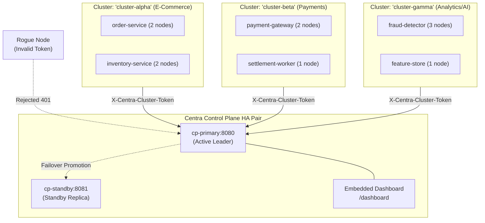

# Centra Control Plane Expansion & Dashboard Simulation

> Interactive multi-cluster simulation showcasing generic $N$-cluster expansion, HA active-passive coordination, rogue node admission defense, dynamic catalog hot-reload, and the embedded real-time Control Plane dashboard.

---

## 🏛️ Overview

The **Centra Control Plane** (`src/Centra.ControlPlane`) serves as the central operational brain for multi-cluster Centra deployments. This sample provides a complete, runnable simulation demonstrating:

1. **Arbitrary Multi-Cluster Partitioning ($N \ge 1$ Clusters)**: Simultaneous coordination of heterogeneous clusters (`cluster-alpha`, `cluster-beta`, `cluster-gamma`) with strictly isolated topology boundaries, dedicated token authentication, and zero cross-cluster crosstalk.
2. **HA Active-Passive Clustering & Fast 307 Redirects**: Coordinated leadership with an active leader and hot standby replicas. Requests targeting standby replicas are redirected with HTTP 307 Temporary Redirects carrying `X-Centra-Role` and `X-Centra-Leader` headers.
3. **Zero-Trust Rogue Node Defense**: Dynamic admission gating rejecting unauthenticated or spoofed nodes attempting unauthorized cluster entry (HTTP 401 Unauthorized), while admitting authenticated cluster nodes.
4. **Dynamic Component & Resilience Policy Hot-Reload**: Real-time push and revision increment of state store components, pub/sub brokers, and Polly v8 resilience policies via REST APIs.
5. **Zero-Downtime HA Leader Failover**: Planned or unplanned primary failure triggers instant standby promotion to Active Leader with zero data loss and uninterrupted client traffic.
6. **Embedded Control Plane Dashboard**: Real-time operational dashboard served directly at `/dashboard` displaying cluster topology, node health, active clusters, and roles.

---

## 📐 Architecture



---

## 🚀 Running the Simulation

### 1. Automated 6-Step Simulation Mode (`--demo`)

Run the automated simulation end-to-end to execute and verify all 6 phases:

```bash
dotnet run --project samples/Centra.Sample.ControlPlane -- --demo
```

Output includes step-by-step verification and a terminal-rendered ASCII dashboard:

```text
================================================================================
 CENTRA FRAMEWORK - CONTROL PLANE EXPANSION & DASHBOARD SIMULATION
================================================================================
[22:50:00.000] Spinning up Primary Control Plane node (cp-primary:8080) [Role: Active Leader]...
[22:50:00.020] Spinning up Standby Control Plane node (cp-standby:8081) [Role: Standby Replica]...

--- STEP 1: High Availability (HA) Active-Passive Clustering & Routing ---
[22:50:00.040] ✓ Primary Node: Role = 'Active', IsLeader = True
[22:50:00.050] ✓ Standby Node: Role = 'Standby', IsLeader = False, ActiveLeader = 'http://cp-primary:8080'
[22:50:00.060] ✓ Standby emitted HTTP 307: Location = 'http://cp-primary:8080/api/v1/topology'

--- STEP 2: Zero-Trust Dynamic Admission & Rogue Node Defense ---
[22:50:00.070] ✓ Admission Gate Rejected Unauthenticated Node (HTTP 401)
[22:50:00.080] ✓ Admission Gate Rejected Spoofed Token (HTTP 401)
[22:50:00.090] ✓ Admission Gate Admitted Authorized Node (HTTP 200): Instance 'order-node-01' joined 'cluster-alpha'

--- STEP 3: Multi-Cluster Fleet Expansion (N Heterogeneous Clusters) ---
[22:50:00.120] ✓ Cluster [cluster-alpha] Topology Isolated: 4 active nodes
[22:50:00.130] ✓ Cluster [cluster-beta] Topology Isolated: 3 active nodes
[22:50:00.140] ✓ Cluster [cluster-gamma] Topology Isolated: 4 active nodes
[22:50:00.150] ✓ Global Operator View: 11 total nodes across 3 clusters verified without crosstalk.

--- STEP 4: Dynamic Component & Resilience Policy Hot-Reload ---
[22:50:00.160] ✓ Component 'orders-cache' registered at Catalog Revision 1
[22:50:00.170] ✓ Component 'billing-events' registered at Catalog Revision 2
[22:50:00.180] ✓ Resilience policy 'payment-circuit-breaker' committed to Catalog.

--- STEP 5: Active-Passive Failover Simulation (Zero Data Loss) ---
[22:50:00.190] ✓ Promoted Standby Status: Role = 'Active', IsLeader = True
[22:50:00.200] ✓ Promoted Leader accepted node heartbeat with zero redirects and zero drops.

--- STEP 6: Embedded Real-Time Control Plane Dashboard Verification ---
[22:50:00.210] ✓ Dashboard UI Endpoint (/dashboard) Verified: HTML, CSS, and Real-Time SSE hooks intact.
╔════════════════════════════════════════════════════════════════════════════════╗
║                 CENTRA CONTROL PLANE - MULTI-CLUSTER DASHBOARD                 ║
╠════════════════════════════════════════════════════════════════════════════════╣
║  Role: [Active    ]  │  Active Clusters: [3]  │  Connected Nodes: [11]     ║
║  Leader: [http://cp-promoted:8081 ]  │  Cluster Status: [HEALTHY]           ║
╠════════════════════════════════════════════════════════════════════════════════╣
...
```

### 2. Live Interactive Browser Inspection (`--demo --hold {seconds}`)

Run the full verification suite and hold the web server open for $N$ seconds to inspect the live dashboard in your web browser:

```bash
dotnet run --project samples/Centra.Sample.ControlPlane -- --demo --hold 30
```

Open [http://localhost:5050/dashboard](http://localhost:5050/dashboard) to view real-time fleet heartbeats.

### 3. Standalone Live Dashboard Server

To run the Control Plane server continuously with background simulated fleet heartbeats:

```bash
dotnet run --project samples/Centra.Sample.ControlPlane
```

Navigate to:
- **Dashboard UI**: [http://localhost:5050/dashboard](http://localhost:5050/dashboard)
- **Topology API**: `http://localhost:5050/api/v1/topology`
- **Health API**: `http://localhost:5050/api/v1/health`
- **Components Catalog**: `http://localhost:5050/api/v1/components`
- **Resilience Catalog**: `http://localhost:5050/api/v1/resilience`

---

## 📁 Source Code References

- [Program.cs](Program.cs) - Entry point for CLI simulation and standalone web hosting.
- [ControlPlaneDemoRunner.cs](Simulation/ControlPlaneDemoRunner.cs) - 6-step simulation orchestrator.
- [HaRoutingSimulationStep.cs](Simulation/HaRoutingSimulationStep.cs) - HA active/standby testing.
- [RogueNodeDefenseSimulationStep.cs](Simulation/RogueNodeDefenseSimulationStep.cs) - Admission gate & token validation.
- [MultiClusterExpansionSimulationStep.cs](Simulation/MultiClusterExpansionSimulationStep.cs) - Multi-cluster isolation.
- [DynamicSyncSimulationStep.cs](Simulation/DynamicSyncSimulationStep.cs) - Dynamic catalog updates.
- [HaFailoverSimulationStep.cs](Simulation/HaFailoverSimulationStep.cs) - Failover verification.
- [DashboardVerificationSimulationStep.cs](Simulation/DashboardVerificationSimulationStep.cs) - Dashboard endpoint validation.
- [AsciiDashboardRenderer.cs](Simulation/AsciiDashboardRenderer.cs) - Console ASCII dashboard visualization.
- [SimulatedNodeFleetHostedService.cs](Services/SimulatedNodeFleetHostedService.cs) - Background heartbeat generation.
