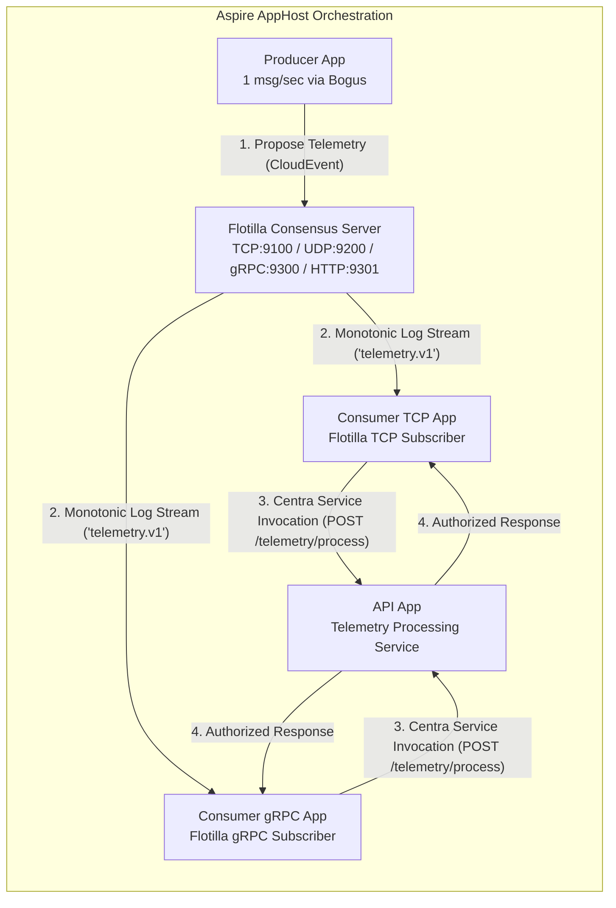

# Flotilla Raft Consensus & Service Invocation Simulation (.NET Aspire)

A distributed sample application demonstrating **CNCF CloudEvents Pub/Sub** via the **Flotilla Raft Consensus Provider** across multi-protocol transports (**TCP**, **UDP**, and **gRPC**) and **Centra Service Invocation** (typed RPC client proxy) across decoupled services, orchestrated locally with **.NET Aspire**.

---

## 🏛️ Architecture & Flow



### Flow Breakdown

1. **`flotilla-server`**:
   - Standalone containerized Flotilla Raft consensus server orchestrated via `builder.AddCentraFlotilla(...)` using the published `ghcr.io/chadahoochie/flotilla:latest` image.
   - Coordinates strict monotonic total order (`LogIndex`), IEEE CRC32 checksums, and terms.
   - Listens on TCP (port 9100), UDP (port 9200), HTTP/2 gRPC (port 9300), and HTTP/1.1 REST (port 9301).
   - Broadcasts committed entries to connected cluster subscribers in real-time.
2. **`flotilla-producer`**:
   - Uses the [`Bogus`](https://github.com/bchavez/Bogus) library to generate realistic synthetic telemetry events (`TelemetryEvent`).
   - Runs a background service emitting 1 message per second.
   - Publishes each telemetry event as a CNCF CloudEvents v1.0 binary message to the `telemetry.v1` topic using Centra's [`IPubSubClient`](../../src/Centra.PubSub.Abstractions/IPubSubClient.cs).
3. **`flotilla-consumer-tcp` & `flotilla-consumer-grpc`**:
   - Configured via **declarative attribute-only discovery**—`builder.Services.AddCentra(...)` automatically scans assemblies for decorated components with zero programmatic registration boilerplate in `Program.cs`.
   - Listens to `telemetry.v1` via [`TelemetryEventHandler`](Consumer/Handlers/TelemetryEventHandler.cs) decorated with `[Topic("pubsub", "telemetry.v1")]` implementing `IEventHandler<TelemetryEvent>`.
   - Preserves distributed tracing (`traceparent`) and CloudEvents context.
   - Invokes `flotilla-api` using the typed RPC client proxy [`ITelemetryApiClient`](Contracts/Clients/ITelemetryApiClient.cs) decorated with `[ServiceClient("flotilla-api")]` and `[ServiceMethod("telemetry/process", "POST")]`.
4. **`flotilla-api`**:
   - Exposes `POST /telemetry/process`.
   - Validates the telemetry payload, computes anomaly scores, and generates incident ticket codes when anomalies exceed threshold.
   - Returns the processed decision to the consumer, completing the turn.

---

## 🚀 Running the Simulation

### Prerequisites
- .NET 10 SDK
- Container runtime (Docker, Podman) for containerized `flotilla-server`

### Command
```bash
dotnet run --project samples/FlotillaSimulation/AppHost
```

### Aspire Dashboard
Once started, Aspire outputs the dashboard link (e.g. `http://localhost:15300`). Open the dashboard to view:
- **Resources**: Real-time health status of `flotilla-server`, `flotilla-api`, `flotilla-consumer-tcp`, `flotilla-consumer-grpc`, and `flotilla-producer`.
- **Console Logs**: Live streaming logs showing generation &rarr; consensus proposal &rarr; commit streaming &rarr; consumption &rarr; service invocation.
- **Distributed Traces**: Unified W3C traces traversing Producer &rarr; Flotilla consensus server &rarr; Consumer handler &rarr; HTTP RPC &rarr; API endpoint.
- **Metrics**: Real-time proposal counts, commit rates, and latency histograms under `Centra.Flotilla.Server` and `Centra`.

---

## 🧪 Automated Testing

The complete flow and attribute-driven registrations are verified by automated tests:
```bash
# Verify declarative attribute-only auto-registration
dotnet test tests/Centra.Tests.Integration --filter "FullyQualifiedName~FlotillaSimulationAttributeRegistrationTests"

# Verify end-to-end multi-protocol Flotilla pub/sub and service invocation
dotnet test tests/Centra.Tests.Integration --filter "FullyQualifiedName~FlotillaServiceInvocationIntegrationTests"
```
