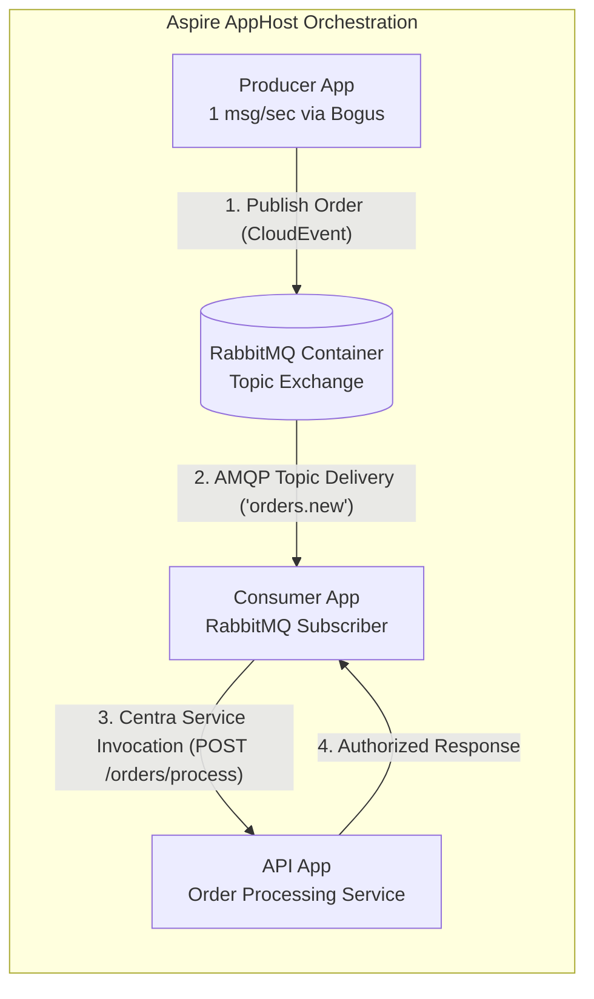

# RabbitMQ & Service Invocation Simulation (.NET Aspire)

A distributed sample application demonstrating **CNCF CloudEvents Pub/Sub** via RabbitMQ and **Centra Service Invocation** (typed RPC client proxy) across three decoupled applications, orchestrated locally with **.NET Aspire**.

---

## 🏛️ Architecture & Flow



### Flow Breakdown

1. **`rabbit-producer`**:
   - Uses the [`Bogus`](https://github.com/bchavez/Bogus) library to generate realistic synthetic orders (`OrderMessage`).
   - Runs a background service emitting 1 message per second.
   - Publishes each order as a CNCF CloudEvents v1.0 binary message to the `orders.new` topic using Centra's [`IPubSubClient`](../../src/Centra.PubSub.Abstractions/IPubSubClient.cs).
2. **`rabbitmq`**:
   - Docker container managed by Aspire with the RabbitMQ Management Plugin enabled.
   - Routes messages through topic exchange `centra.pubsub` to bound queue `centra.pubsub.orders.new`.
3. **`rabbit-consumer`**:
   - Configured via **declarative attribute-only discovery**—`builder.Services.AddCentra(...)` automatically scans assemblies for decorated components with zero programmatic registration boilerplate in `Program.cs`.
   - Listens to `orders.new` via [`OrderSubmittedEventHandler`](Consumer/Handlers/OrderSubmittedEventHandler.cs) decorated with `[Topic("pubsub", "orders.new")]` implementing `IEventHandler<OrderMessage>`.
   - Preserves distributed tracing (`traceparent`) and CloudEvents context.
   - Invokes `rabbit-api` using the typed RPC client proxy [`IOrderApiClient`](Contracts/Clients/IOrderApiClient.cs) decorated with `[ServiceClient("rabbit-api")]` and `[ServiceMethod("orders/process", "POST")]`.
4. **`rabbit-api`**:
   - Exposes `POST /orders/process`.
   - Validates the order, applies business logic (volume discounts, pricing rules), and generates authorization codes.
   - Returns the approved response to the consumer, completing the turn.

---

## 🚀 Running the Simulation

### Prerequisites
- .NET 10 SDK
- Docker Desktop or Podman (for running the RabbitMQ container)

### Command
```bash
dotnet run --project samples/RabbitSimulation/AppHost
```

### Aspire Dashboard
Once started, Aspire outputs the dashboard link (e.g. `http://localhost:18888`). Open the dashboard to view:
- **Resources**: Real-time health status of `rabbitmq`, `rabbit-api`, `rabbit-consumer`, and `rabbit-producer`.
- **Console Logs**: Live streaming logs showing generation -> queueing -> consumption -> service invocation.
- **Distributed Traces**: Unified W3C traces traversing Producer -> RabbitMQ broker -> Consumer handler -> HTTP RPC -> API endpoint.
- **RabbitMQ Management UI**: Direct link available at `http://localhost:15672` (default credentials `guest`/`guest`).

---

## 🧪 Automated Testing

The complete flow and attribute-driven registrations are verified by automated tests:
```bash
# Verify declarative attribute-only auto-registration
dotnet test tests/Centra.Tests.Integration --filter "FullyQualifiedName~RabbitMQSimulationAttributeRegistrationTests"

# Verify end-to-end RabbitMQ pub/sub and service invocation (requires Docker)
dotnet test tests/Centra.Tests.Integration --filter "FullyQualifiedName~RabbitMQServiceInvocationIntegrationTests"
```
